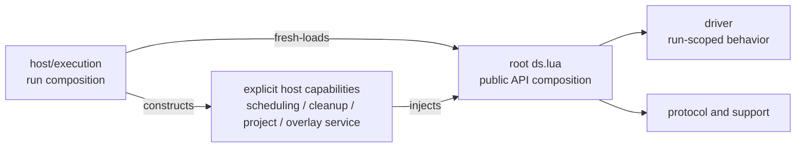

# `ds.lua` Composition Exception Removal Proposal

## Summary

Remove the temporary dependency from root `dwarfspec.ds` to `dwarfspec.host`.
The host will continue to fresh-load the run-scoped `ds` factory, but will pass
the narrow scheduling, cleanup, project-environment, and overlay-service
capabilities needed to assemble the driver. The public `ds` API will not
change.

This is an ownership change, not a module-loading redesign. Deliberate
`loadfile()` freshness and source-versus-installed fallback remain intact. The
work will not add a shared module loader, cache invalidation scheme, package
searcher changes, or import interception.

The separate unified-internal-loading proposal may revisit that loading model
later. It is neither required nor authorized by this plan.

## Current exception

At approval, root `ds.lua` fresh-loaded these five host modules:

- `dwarfspec.host.diagnostics.diagnostics`;
- `dwarfspec.host.game.overlay_registration`;
- `dwarfspec.host.game.save_game_mount`;
- `dwarfspec.host.game.save_game_load`; and
- `dwarfspec.host.game.save_game_unload`.

The save-game modules have since moved to `driver/game`, interaction
diagnostics have moved to `driver/diagnostics`, and overlay registration has
been split between `driver/overlay` workflow ownership and host-owned external
services. Root `ds.lua` now imports no host module.

The host execution root still fresh-loads `dwarfspec.ds`; composition is now
one-way from the host through injected capabilities into the root factory.

## Proposed ownership

Move the save-game preflight and load/unload workflows to `driver/` because
they implement test-facing, run-scoped game behavior. Move interaction
diagnostics to `driver/` because they inspect driver-owned subjects and format
driver operation failures.

Split overlay registration by ownership: driver code owns the run-scoped stage
and rollback workflow, while the host supplies project-path resolution and the
external DFHack overlay/file operations through an injected capability. This
keeps environment and service access in `host/` without making driver modules
import host modules.

## Capability boundary

The host will inject only operations already required by driver-facing code:

- scheduling: bounded `wait_until()` and `wait_frames()` operations backed by
  the current run scheduler;
- cleanup: mark the current cleanup position, register a labeled action, and
  roll back to a mark after construction or staging failure;
- project environment: resolve one project-relative Lua source and return its
  validated relative and absolute paths;
- overlay service: read/write/remove files, query file existence, rescan
  overlays, inspect registered names, and expose the active overlay script and
  configuration locations; and
- run context: the current immutable run identifier needed to name owned
  integration artifacts.

The scheduler instance, cleanup registry, project object, and retained host
service registry remain host-owned. Driver code receives capability functions,
not access to those host implementations or registries.

## Compatibility and verification

Implementation must retain the existing public `ds` functions, enums, return
values, failures, cleanup order, and live behavior. Both composition roots keep
their current local fresh-loading helpers and installed-package fallback.

Unit tests cover each relocated workflow using injected fakes. One Busted
dependency-rule spec examines declared static imports beneath `driver/` and
rejects any `dwarfspec.host` target. This test does not override Lua loading or
assert that named files merely exist. Focused and full live gates verify
save-game behavior, overlay restoration, diagnostics, scheduler behavior, and
cleanup. The completed source-organization proposal and decomposition contract
were previously retired; their surviving architecture contract now records
the final one-way dependency boundary.

## Approval

Status: approved on 2026-08-01. Implementation remains separate from the
completed source-organization checklist.

Implementation status: the composition exception has been removed and the
driver-to-host dependency rule is enforced by the unit suite.
