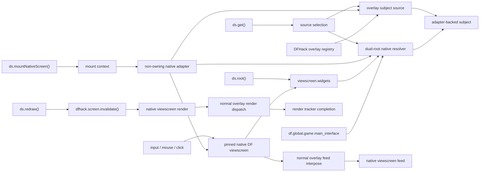

# Non-owning native-screen mount proposal

## Summary

DwarfSpec exposes `ds.mountNativeScreen()` to attach the current run to the
current native DF viewscreen:

```lua
local root = ds.mountNativeScreen()

ds.input('D_UNITLIST')
local list = ds.get({
    'info',
    'creatures',
    'Tabs',
    'Residents',
    0,
    'Unit List',
    1,
    0,
})
list:move_pointer('center')
ds.mouseInput(ds.EMouseButton.SCROLL_DOWN)

ds.redraw()
ds.unmount()
```

The native viewscreen's `widgets` container remains the exact `ds.root()`.
Ordinary `ds.get()` calls resolve either direct viewscreen-widget paths or
complete paths rooted at `df.global.game.main_interface`, including a declared
DF-field prefix followed by exact widget segments. Inspection, pointer
placement, input, clicks, text access, redraw, and tree capture operate on the
real base-game `df.widget` objects exposed by DFHack.

Registered DFHack overlays remain queryable through the same commands with an
explicit subject-source option. The native screen and every queried widget are
borrowed. DwarfSpec must not create a `ZScreen`, alter the screen stack,
dismiss a screen, instantiate a native widget, or take ownership of an overlay.

## Goals

- Attach to the current native DF viewscreen without creating another screen.
- Preserve the current viewscreen stack and DFHack focus.
- Make the attached screen the target for `ds.input()`, `ds.mouseInput()`, and
  `ds.redraw()`.
- Keep `viewscreen.widgets` as the exact default root for `ds.root()`.
- Resolve ordinary native `ds.get()` paths from both `viewscreen.widgets` and
  the fixed `df.global.game.main_interface` structural root.
- Keep exact `native_root` selection as an advanced ambiguity or compatibility
  escape hatch.
- Support native widget traversal by name and zero-based child index.
- Preserve the existing fluent `dwarfspec.Subject` API for native and Lua
  widgets.
- Support pointer placement by subject or arbitrary native UI-grid cells.
- Exercise DFHack's real native input and overlay-registry dispatch paths.
- Instrument completed rendering so `ds.redraw()` waits by default.
- Restore pointer state and render instrumentation during every cleanup path.
- Never dismiss or otherwise own the attached native game screen.

## Non-goals

- Creating semantic aliases for unstable or unnamed base-game controls.
- Promising that every native widget type exposes meaningful text.
- Calling native widget callbacks directly instead of using normal screen input.
- Enabling, disabling, positioning, or otherwise managing registered overlays.
- Navigating back if test input changes the current native viewscreen.
- Supporting a DFHack Lua screen that currently owns focus above the native
  screen.
- Retaining a no-argument `ds.mount()` overload or compatibility alias.

## DFHack capabilities

Modern DF viewscreens expose a `widgets` field of type
`df.widget_container`. DFHack provides:

- `dfhack.gui.getWidget(container, name_or_index, ...)` for chained lookup;
- `dfhack.gui.getWidgetChildren(container)` for enumeration;
- `df.widget.name` for native identifiers;
- `df.widget.rect` and the inherited `get_rect()` method for geometry;
- `df.widget.flag` for native visibility and activity;
- type-specific state such as `df.widget_text.str`,
  `df.widget_textbox.str`, `df.widget_scroll_rows.scroll`, and table or tab
  selection state.

See:

- [DFHack Lua API widget lookup](https://docs.dfhack.org/en/53.11-r1/docs/dev/Lua%20API.html#screens)
- [DF native widget definitions](https://github.com/DFHack/dfhack/blob/53.15-r1/library/xml/df.g_src.ViewBase.xml)

These are typed DF object references. Lua reports them as `userdata`, unlike
DFHack Lua `gui.View` objects, which are tables.

## Original DwarfSpec constraints

Before native-screen mounting was introduced, the component-mount
implementation assumed one Lua `gui.View` tree:

- `subject.new()` requires the raw object to be a table.
- Control paths walk `view.subviews` and compare `child.view_id`.
- Subject liveness is tracked by raw Lua object identity.
- Inspection reads Lua-view fields such as `frame_body`, `visible`, and
  `active`.
- `mount.host_screen` simultaneously represents screen ownership, interaction
  routing, and render instrumentation.

None of those assumptions should be applied directly to native DF widgets.
The public subject API can remain common, but traversal, identity, inspection,
and liveness need adapter-specific implementations.

## Accepted public API

### Native attachment

`ds.mountNativeScreen()` attaches the current native DF viewscreen and returns
a subject for its `widgets` container:

```lua
local native_root = ds.mountNativeScreen()

assert.equals(
    dfhack.gui.getDFViewscreen(true).widgets,
    native_root:raw())
```

`ds.mount(component, options)` is exclusively for ordinary widgets, overlay
widgets, and `ZScreen` components. The two commands converge on one mount
context, enforce one current mount, and share `ds.unmount()` cleanup. “Mount”
describes that DwarfSpec lifecycle, while “native attachment” describes the
borrowed implementation resource.

### Native control paths

`ds.get()` accepts either the existing string path or a path-segment array:

```lua
ds.get('simple_child')
ds.get({'Tabs', 0, 'Right panel'})
```

Each native segment is:

- a nonempty string naming a declared game-UI field or exact native widget;
  or
- after widget traversal begins, a nonnegative integer selecting a zero-based
  child index.

The segment-array form is authoritative for native widgets because native
names can contain `/` and native lookup already supports numeric indices.
Existing slash-delimited string paths remain unchanged for component mounts
and work for simple native names that contain no slash.

For paths that begin with a declared field on
`df.global.game.main_interface`, lookup traverses exact declared data fields
until the first non-field segment on a `df.widget_container`. It then switches
permanently to `dfhack.gui.getWidget()` traversal. Direct
`viewscreen.widgets` lookup remains available in parallel.

If only one automatic root succeeds, DwarfSpec returns that widget. Results
with the same native identity are deduplicated; different identities fail as
ambiguous. An explicit `native_root` request bypasses automatic dual-root
resolution.

Failure diagnostics include:

- the complete requested path;
- the structural field prefix and widget suffix;
- the segment that failed;
- the current DF type or resolved widget parent;
- bounded named and indexed child summaries.

### Subject sources

Native mounts expose two subject sources:

1. `ds.ESubjectSource.NATIVE`, backed by native dual-root resolution while
   keeping `viewscreen.widgets` as the exact root subject;
2. `ds.ESubjectSource.OVERLAY`, backed by a selected live overlay-registry
   widget.

Define `ESubjectSource` with the existing immutable enum helper. Native is the
default:

```lua
local native_list = ds.get({'Tabs', 0, 'List'})
```

Full base-game paths require no source options:

```lua
local deceased = ds.get({
    'info',
    'creatures',
    'Tabs',
    'Dead/Missing',
})
```

Use `native_root` only to resolve a real ambiguity or bypass an unsupported
structural field:

```lua
local creatures = df.global.game.main_interface.info.creatures
local deceased = ds.get({'Tabs', 'Dead/Missing'}, {
    native_root=creatures,
})
```

Overlay lookup uses the same command with explicit options:

```lua
local overlay_list = ds.get('list', {
    source=ds.ESubjectSource.OVERLAY,
    overlay='gui/example.ExampleOverlay',
})
```

`ds.root()` and `ds.capture_view_tree()` accept the same optional source
selection:

```lua
local overlay_root = ds.root({
    source=ds.ESubjectSource.OVERLAY,
    overlay='gui/example.ExampleOverlay',
})

ds.capture_view_tree('native-tree')
ds.capture_view_tree('overlay-tree', {
    source=ds.ESubjectSource.OVERLAY,
    overlay='gui/example.ExampleOverlay',
})
```

An overlay registry name is runtime data and remains a string. The subject
source itself is an enum so internal behavior is not selected with loose
identifier strings.

### Pointer placement

The existing subject form works for native and overlay subjects:

```lua
ds.get({'Tabs', 0, 'List'}):move_pointer('center')
```

Extend the existing top-level command with an absolute-coordinate overload:

```lua
ds.move_pointer(42, 17)
```

Coordinates are zero-based native UI-grid cells, integral, and within the
current window bounds.

### Input and redraw

All input is dispatched through the pinned native viewscreen:

```lua
ds.input('SELECT')
ds.get({'Tabs', 0, 'List'}):input('CURSOR_DOWN')
ds.mouseInput(ds.EMouseButton.LEFT)
ds.get({'Tabs', 0, 'Confirm'}):click()
```

A subject selects geometry and diagnostic context. It does not bypass normal
native or overlay input routing.

Redraw remains wait-by-default:

```lua
ds.redraw()
ds.get({'Tabs', 0, 'List'}):redraw()
ds.redraw(nil, {wait=false})
```

## Internal design

### Separate ownership, interaction, and subjects

The mount record should separate these concepts:

```text
host_screen
    A screen owned by DwarfSpec. Nil for a native mount.

interaction_target
    The pinned native viewscreen used for input and redraw.

subject_sources
    Query roots and adapters for native and overlay subjects.

render_observer
    Reversible instrumentation that advances the render tracker.
```

Only `host_screen` belongs in `mount_context.owned_screens`. A native mount
must contribute zero DwarfSpec-owned screens.



### Interaction target

The internal interaction target should provide:

```text
native_screen() -> pinned viewscreen
assert_current() -> nil or explicit stale-screen error
invalidate() -> result
```

Existing component mounts return an interaction target backed by their shown
`ZScreen`. A native mount returns one backed by the borrowed DF viewscreen and
leaves `host_screen` unset.

Every input, pointer, subject, inspection, and redraw operation calls
`assert_current()` before dereferencing native widgets.

### Adapter-backed subjects

A `dwarfspec.Subject` should retain a target descriptor instead of assuming
that its raw object is a Lua table:

```text
mount_id
source
path_segments
adapter
captured_identity
control_path_for_diagnostics
```

The adapter contract should provide:

```text
root() -> raw object
resolve(path_segments) -> raw object
identity(raw) -> stable identity
contains(raw) -> boolean
children(raw) -> ordered child descriptors
name(raw) -> string or nil
native_type(raw) -> string
bounds(raw) -> normalized screen rectangle or nil
visible(raw) -> boolean
active(raw) -> boolean
focused(raw) -> boolean
text(raw) -> string or nil
tooltip(raw) -> string or nil
```

Every adapter method and class must have LuaDoc comments.

`Subject:raw()` resolves the descriptor against the current mount and returns
the actual object:

- native subjects return typed DF userdata;
- component and overlay subjects return their actual Lua tables.

No public proxy object replaces the underlying widget.

### Native subject adapter

The default native root adapter is rooted at the exact
`attached_screen.widgets` container. Ordinary `ds.get()` also owns a game-UI
locator rooted at `df.global.game.main_interface`. The locator reads only
declared DF data fields, transitions once to widget traversal, and retains the
structural prefix and widget suffix for reacquisition.

A caller can select an exact DFHack-exposed `df.widget_container` with
`native_root` to bypass automatic resolution. None of these subject roots
changes the attached interaction target.

Traversal uses:

```lua
dfhack.gui.getWidget(container, segment)
dfhack.gui.getWidgetChildren(container)
```

Named segments use native widget names. Numeric segments use zero-based child
indices. The adapter records both the requested path and captured raw pointer
identity.

Native typed references are Lua userdata wrappers. A wrapper must not be held
only through a weak value: the Lua wrapper could be collected while the
underlying DF widget remains alive. The subject should retain its locator and
reacquire the widget from the pinned root before each operation.

Liveness validation follows this order:

1. verify the attached native viewscreen is still current;
2. reacquire the widget through the recorded path;
3. require the resolved widget to equal the captured typed-reference identity;
4. only then inspect or interact with it.

If a screen transition or UI rebuild replaces a widget at the same path, the
old subject is stale. DwarfSpec must not silently bind it to the replacement.
A new `ds.get()` returns a new subject.

This ordering minimizes the risk of dereferencing a native object after its
owning screen has changed.

### Native bounds

The native adapter normalizes the widget's current DF rectangle into the same
zero-based inclusive shape used by subject inspection and pointer placement:

```text
x1, y1, x2, y2
```

Existing DFHack code uses `widget.rect` for current rendered geometry. The
adapter should use `widget:get_rect()` when the bound virtual method is
available and otherwise use `widget.rect`; it must not manually reconstruct
layout from offsets and anchors. Unit fixtures and live coverage must verify
that the normalized result matches the rendered native control. The adapter
also validates that the result is integral and intersects the current window.

An empty or invalid rectangle remains inspectable but cannot be used for
subject-relative pointer placement or clicking.

### Native visibility and activity

Map native widget state directly:

```text
visible -> widget.flag.VISIBILITY_VISIBLE
active  -> widget.flag.VISIBILITY_ACTIVE
```

Inspection should also calculate effective visibility and activity through the
native parent chain if those fields are added to the public inspection schema.
Direct flags must remain separately identifiable so tests do not confuse a
widget's state with inherited eligibility.

DwarfSpec lookup must not exclude invisible or inactive descendants. Tests
need to locate them to assert visibility/activity behavior.

### Native text and inspection

Native text extraction should use an explicit type-aware extractor registry.
Initial extractors should cover at least:

- `df.widget_text.str`;
- `df.widget_text_truncated.str`;
- `df.widget_text_multiline.str`;
- `df.widget_textbox.str`;
- `df.widget_better_button.display_string` when the function is present and
  safe to call;
- aggregate container text by recursively collecting visible textual
  descendants when a direct value is unavailable.

Read-only inspection must never invoke activation, mutation, selection, or
input callbacks. Unsupported widget types return `nil` text instead of
guessing from the rendered screen buffer.

Native inspection should additionally expose stable useful state when
available, including:

- native type;
- widget name;
- direct and effective visibility/activity;
- bounds;
- tooltip string;
- scroll position and visible-row count for scroll-row widgets;
- selected index for tabs, dropdowns, and radio rows.

These additions should be represented by documented optional fields instead
of an unbounded raw table dump.

### Lua view adapter

Existing component and overlay subjects use a Lua-view adapter that preserves
current behavior:

- children from `subviews`;
- identifiers from `view_id`;
- bounds from `frame_body`;
- state through evaluated `visible` and `active`;
- current diagnostics and text extraction.

This adapter becomes the compatibility layer around existing subject behavior.
The component mount API and control-path semantics do not change.

### Overlay subject source

Overlay subjects are additional roots, not children of
`viewscreen.widgets`.

The source:

1. reads `require('plugins.overlay').get_state()`;
2. resolves the exact requested registry entry;
3. requires it to be enabled;
4. pins the exact Lua overlay widget;
5. delegates traversal and inspection to the Lua-view adapter.

Each overlay subject operation verifies that the registry still maps the same
name to the pinned widget. An overlay rescan makes existing subjects stale;
DwarfSpec must not silently rebind them.

Selecting an overlay subject does not change normal dispatch. Click, input,
mouse input, and redraw still go through the pinned native screen.

### Acquiring the native screen

At attachment:

1. read `dfhack.gui.getCurViewscreen(true)`;
2. read `dfhack.gui.getDFViewscreen(true)`;
3. require both calls to identify the same viewscreen;
4. require a valid `widgets` container;
5. capture the exact viewscreen identity and widget root;
6. install render observation;
7. invalidate once and wait for one completed render.

Requiring current-screen identity prevents DwarfSpec from bypassing a DFHack
Lua screen that currently owns focus.

The viewscreen remains pinned for the mount lifetime. If normal input changes
screens, subsequent operations fail and ask the test to unmount and attach
again. Cleanup must not navigate back.

### Normal input dispatch

Input is sent through:

```lua
gui.simulateInput(attached_native_screen, keys)
```

DFHack's overlay plugin receives input through its normal viewscreen
interposition before unhandled input reaches the base game. DwarfSpec must not
call a native widget callback or overlay `onInput()` directly.

Subject clicks:

1. resolve and validate the subject;
2. calculate the selected point from normalized bounds;
3. set the virtual pointer through the existing pointer adapter;
4. dispatch the mouse key through the attached native viewscreen;
5. wait for completed rendering by default.

This produces the same routing order as real player input.

### Native render observation

The current render instrumentation wraps a Lua screen instance's `onRender()`.
Native viewscreens are userdata and cannot use that mechanism.

Add a reversible native observer around
`plugins.overlay.render_viewscreen_widgets`:

- capture the exact original function;
- invoke it with the original arguments and preserve results and errors;
- advance the mount render tracker only after successful dispatch for the
  attached native viewscreen;
- report intercepted render failures through the existing tracker;
- restore the exact original function during cleanup;
- detect and report conflicting replacement before restoration.

The overlay render dispatcher runs after the real native screen render, making
it the required completion boundary for a mount that must also observe normal
overlay rendering.

Attachment performs one invalidate-and-wait capability check. Missing overlay
dispatch or an unsupported native screen fails explicitly instead of leaving
future redraws unable to complete.

### Redraw

For a native interaction target, invalidation calls:

```lua
dfhack.screen.invalidate()
```

The existing mutation sequence remains:

1. capture the current render generation;
2. invalidate;
3. yield through the automation scheduler;
4. complete when native overlay dispatch finishes for the pinned screen;
5. preserve `{wait=false}` as an explicit opt-out.

### Pointer cleanup

The existing pointer adapter remains authoritative for:

- virtual `dfhack.screen.getMousePos()`;
- GPS pointer coordinates;
- mouse focus and tracking;
- explicit button down/up state;
- restoration during cleanup.

Cleanup ordering remains LIFO:

1. restore pointer and button state;
2. restore native render observation;
3. clear subject descriptors and mount records;
4. release the borrowed attachment without touching the native screen.

No native screen or widget dismissal action is registered.

## Required implementation changes

### `src/dwarfspec/ds.lua`

- Add zero-argument `ds.mountNativeScreen()` for native-screen mounts and keep
  `ds.mount(component, options)` component-only.
- Export immutable `ESubjectSource`.
- Add optional subject-source arguments to `ds.root()`, `ds.get()`, and
  `ds.capture_view_tree()`.
- Accept string or segment-array control paths.
- Resolve native `ds.get()` through compatible viewscreen and game-UI roots,
  deduplicate equal identities, and reject ambiguity.
- Resolve interaction commands through `mount.interaction_target`.
- Extend `ds.move_pointer()` with the `(x, y)` overload.
- Preserve existing component-mount behavior.

### `src/dwarfspec/subject.lua`

- Replace the table-only raw-view assumption with an adapter-backed target
  descriptor.
- Permit raw results to be Lua tables or typed DF userdata.
- Reacquire and validate raw subjects before every command.
- Keep the public fluent API unchanged.

### `src/dwarfspec/mount_context.lua`

- Separate owned screens, interaction targets, and subject sources.
- Generalize root and path resolution through the selected adapter.
- Track subject descriptors instead of treating raw object membership as
  ownership.
- Preserve stale-mount and retained-subject diagnostics.
- Keep native screens and widgets out of ownership evidence.

### `src/dwarfspec/automation/diagnostics.lua`

- Delegate inspection and tree capture to subject adapters.
- Support bounded capture of DF userdata widget trees.
- Add documented optional native-widget state.
- Avoid recursively dumping arbitrary DF userdata fields.

### Native subject modules

Add focused modules for:

- native viewscreen attachment and current-screen validation;
- native widget traversal and identity;
- declared `main_interface` field traversal and dual-root resolution;
- native bounds and state inspection;
- native text extraction;
- subject-source selection;
- native render observation.

Do not combine these concerns into the existing isolated overlay mount
controller.

### Existing mount adapters

- Return an interaction target and Lua subject source alongside owned screens.
- Preserve existing show, resize, dismissal, and instance-level render
  instrumentation behavior.

### `src/ds.d.lua`

- Document `DS.mountNativeScreen()` as a non-owning current-native-screen
  mount that returns a borrowed root subject.
- Define native path segment and path types.
- Define immutable `ESubjectSource`.
- Document source options for root, get, and tree capture.
- Document full game-UI paths, structural-to-widget transition, dual-root
  compatibility, and explicit-root ambiguity resolution.
- Document that `Subject:raw()` can return a Lua table or typed DF userdata.
- Add optional native inspection fields.
- Document the absolute pointer overload.

## Failure contracts

The implementation should produce explicit errors for:

- no current native DF viewscreen;
- a DFHack Lua screen currently owning focus;
- a native screen without a valid widget root;
- a missing native name or index path segment;
- a missing or unsupported declared game-UI field;
- a structural path that does not reach a native widget;
- automatic roots that resolve different native widget identities;
- a string path containing an ambiguous native `/` name;
- an invalid subject-source enum value;
- a requested overlay that is missing or disabled;
- a native or overlay widget replaced at the same path;
- a retained widget removed from its pinned root;
- the attached viewscreen no longer being current;
- a subject without usable on-screen bounds for pointer interaction;
- coordinates outside the current window;
- unavailable native render observation;
- conflicting render instrumentation during cleanup;
- an attempt to resize the borrowed native screen through `ds.viewport()`.

None of these failures authorize DwarfSpec to dismiss, replace, or navigate a
screen.

## Verification

Unit coverage should prove:

- `ds.mountNativeScreen()` selects native attachment without component
  classification;
- no `ZScreen` is constructed, shown, resized, or dismissed;
- the current native viewscreen and focus remain unchanged;
- a DFHack Lua screen above the native screen causes explicit rejection;
- `ds.root():raw()` returns the exact native `widgets` container;
- native paths resolve named and zero-based indexed children;
- names containing `/` work through segment-array paths;
- complete game-UI paths traverse exact declared fields and then exact widgets;
- viewscreen-only and game-UI-only results remain compatible;
- equal dual-root identities deduplicate and different identities fail as
  ambiguous;
- explicit `native_root` bypasses automatic dual-root resolution;
- missing path diagnostics enumerate bounded native children;
- invisible and inactive native widgets remain queryable;
- native bounds, state, text, tooltip, scroll, and selection extraction are
  type-aware and bounded;
- unsupported native text types return `nil`;
- raw access returns the exact typed DF userdata;
- subjects reacquire the same native identity before every operation;
- replacement and removal make retained subjects stale;
- overlay lookup returns the exact registry widget through the Lua adapter;
- source selection uses only immutable enum values;
- native and overlay subject clicks route through the pinned native screen;
- arbitrary coordinate pointer placement reaches pointer and GPS state;
- click, down, up, and wheel inputs use the selected pointer position;
- redraw waits only for completed rendering of the pinned screen;
- `{wait=false}` invalidates without waiting;
- a screen transition rejects further operations without navigation;
- pointer, button, subject, and render state restore on unmount and injected
  failure;
- cleanup evidence reports zero DwarfSpec-owned screens for a native mount.

A live DFHack test should:

1. capture the current viewscreen, widget root, focus strings, screen stack, and
   pointer state;
2. attach with `ds.mountNativeScreen()`;
3. prove `ds.root():raw()` is the exact native widget root;
4. resolve named and indexed direct viewscreen controls through `ds.get()`;
5. resolve a real list row through a complete
   `df.global.game.main_interface` structural and widget path;
6. inspect native bounds, visibility/activity, and text;
7. interact with a base-game control through subject pointer placement and
   normal input;
8. resolve and interact with a registered overlay through explicit source
   selection;
9. call subject and top-level redraws and observe completed native-plus-overlay
   rendering;
10. unmount;
11. prove the original screen, focus, stack, and pointer state remain intact;
12. prove render instrumentation is restored exactly;
13. prove no native screen or widget was dismissed.

Test-owned overlay registration and configuration must be restored
independently. Native attachment itself remains read-only with respect to the
overlay registry.

## Alternatives rejected

### Keep the no-argument `ds.mount()` overload

One-current-mount semantics belongs to the shared mount context, not to the
number of public entry points. Keeping the overload would make a missing
component silently select a materially different ownership model. Explicit
`ds.mountNativeScreen()` makes the borrowed native-screen behavior clear and
keeps `ds.mount(component, options)` component-only.

### Create a transparent `ZScreen`

Even a pass-through screen changes focus and the viewscreen stack and creates
dismissal ownership. It cannot prove real native-screen behavior.

### Treat native widgets as Lua `gui.View` objects

Native widgets are typed DF userdata with different hierarchy, geometry,
state, and lifetime rules. Adding scattered `type(value) == 'userdata'`
branches would make subject behavior inconsistent and unsafe. Explicit
adapters keep the public API common while preserving each model's contract.

### Use only absolute coordinates

Coordinates cannot provide stable native control identity, bounds inspection,
text, visibility/activity assertions, or fluent subject operations. DFHack
already exposes the native widget tree, so DwarfSpec should use it.

### Query only overlay widgets

That omits the primary base-game UI under test. Overlay widgets are an
additional source layered over the native screen, not a replacement for
`viewscreen.widgets` or widget containers reached through
`df.global.game.main_interface`.

### Call native widget callbacks directly

Direct callbacks bypass normal focus, overlay priority, mouse state, and native
input fall-through. Subjects must drive the pinned viewscreen through
`gui.simulateInput()`.

### Silently rebind replaced widgets

Native UI rebuilds and overlay rescans can place a different widget at the
same path. Rebinding would make a retained subject change identity. Explicit
stale-subject errors preserve deterministic tests.

## Recommendation

Implement `ds.mountNativeScreen()` as a non-owning native-screen mount whose
exact root subject is the native viewscreen's `widgets` container. Resolve
ordinary native `ds.get()` calls compatibly from that root and from declared
paths under `df.global.game.main_interface`; reserve `native_root` for explicit
bypass.
Generalize `Subject` around explicit native-widget and Lua-view adapters, add
segment-array native paths, and expose overlays through an immutable
subject-source selector.

Keep interaction routing and render completion attached to the real native
viewscreen. This provides semantic `ds.get()` access to base-game and overlay
controls while preserving focus, screen-stack ownership, normal DFHack
dispatch, and exact cleanup.
