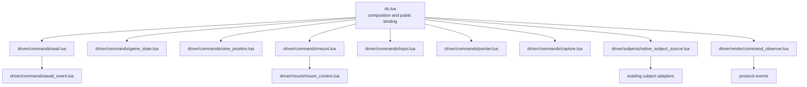
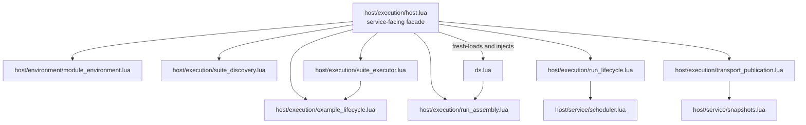
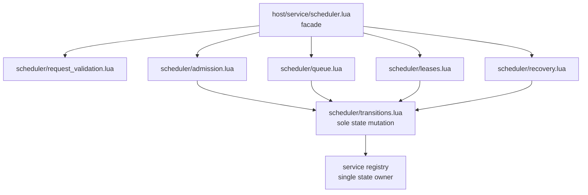
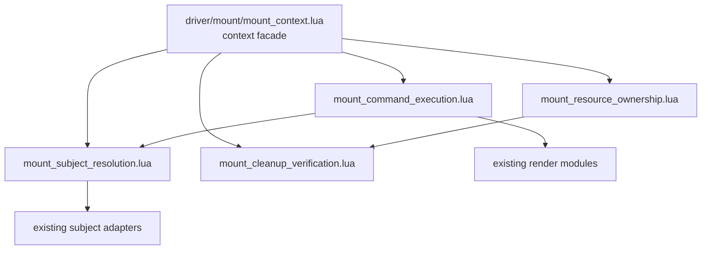
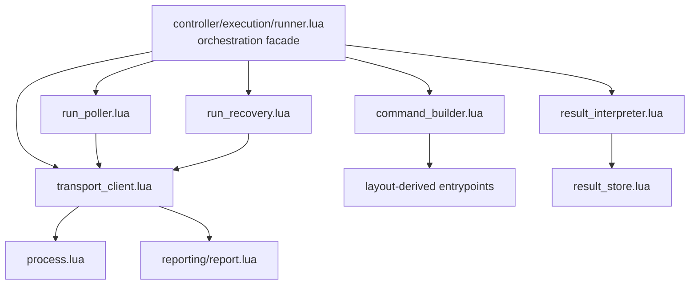

# Source Organization Decomposition Proposals

Status: approved 2026-08-01.

This document defines the five late decompositions required after the initial
directory migration. It is an implementation contract, not authorization to
change production code. Each split preserves public behavior, source-versus-
installed loading, deliberate fresh loading, cleanup order, diagnostics, and
the temporary root `ds.lua` composition exception.

## Shared rules

- Root and namespace facades retain their current public functions while
  delegating named responsibilities to the modules below.
- Extracted modules receive narrow dependencies explicitly. Driver modules do
  not import host modules; root `ds.lua` injects the required host capabilities.
- Existing `process.lua`, `report.lua`, `result_store.lua`, service registry,
  mount adapters, subject adapters, and render modules retain their current
  ownership. The new modules coordinate those authorities rather than
  duplicating them.
- Tests assert behavior, state transitions, cleanup, diagnostics, and exact
  argument or event contracts. They do not merely assert that files exist.
- No `utils.lua`, `helpers.lua`, `common.lua`, or comparable dumping-ground
  module is permitted.

## Root ds.lua

### Retained responsibility

`dwarfspec.ds` remains the run-scoped composition root. It loads fresh source
or installed modules, assembles explicit dependencies, constructs the public
`ds` table, binds its public functions, and exports the established enums. It
continues to be the sole temporary location allowed to load both host and
driver modules.

### Extracted modules

| Module | Responsibility | Direct behavioral coverage |
|---|---|---|
| `driver/commands/wait.lua` | Normalize wait limits and implement frame, tick, predicate, and event waits through injected scheduler capabilities. It delegates event matching to the existing `await_event.lua`. | `driver/commands/wait_spec.lua`: default limits, explicit limits, predicate results, event delegation, timeout propagation, and invalid arguments. |
| `driver/commands/game_state.lua` | Read and mutate pause and game-speed state, expose tick/time/save-directory observations, and register exact restoration actions through injected cleanup capabilities. | `driver/commands/game_state_spec.lua`: validation, ratio comparison, pause/speed restoration, observations, and cleanup failures. |
| `driver/commands/view_position.lua` | Normalize screen origins, calculate viewport offsets, read map position, set a bounded position, and register restoration. | `driver/commands/view_position_spec.lua`: every origin, viewport sizes, bounds, restoration, and unavailable-map errors. |
| `driver/commands/mount.lua` | Adapt the public mount, native mount, root, get, inspect, redraw, view-tree capture, unmount, and viewport commands to `mount_context`. It owns command argument normalization, not mounted resources. | `driver/commands/mount_spec.lua`: delegation, source selection, stale subjects, redraw options, capture options, explicit unmount, and viewport validation. |
| `driver/commands/input.lua` | Resolve an interaction target and adapt keyboard and text input to the current target without owning pointer geometry. | `driver/commands/input_spec.lua`: default/current targets, explicit subjects, input normalization, text input, focus failures, and simulated-input errors. |
| `driver/commands/pointer.lua` | Validate pointer spaces, anchors, coordinates, wheel options, buttons, and actions; calculate requested pointer targets; and adapt move, hover, click, mouse-input, and wheel commands to the pointer adapter. | `driver/commands/pointer_spec.lua`: grid/pixel/world/subject movement, clipping, anchors, wheel batching, button actions, restoration, and diagnostics. |
| `driver/commands/capture.lua` | Normalize screen-capture requests and delegate screen capture through the mounted render context. | `driver/commands/capture_spec.lua`: default names, explicit bounds/options, missing mounts, and capture failures. |
| `driver/subjects/native_subject_source.lua` | Construct native and registered-overlay subject sources and perform exact viewscreen/game-UI dual-root resolution with bounded ambiguity and failure evidence. | `driver/subjects/native_subject_source_spec.lua`: viewscreen paths, game-UI paths, deduplication, ambiguity, explicit roots, overlays, and invalidated identities. |
| `driver/render/command_observer.lua` | Publish command-started/finished events, retain bounded failure text, and attach mount diagnostics without owning protocol storage or rendering. | `driver/render/command_observer_spec.lua`: event payloads, success/failure timing, bounded text, subject identity, and mount diagnostic attachment. |

Existing save-game, search, and overlay-registration command modules remain
where they are. Root `ds.lua` continues to inject host save-game,
overlay-registration, diagnostics, scheduler, and cleanup capabilities until
the separately proposed option 2 work is approved and implemented.

## Host execution

### Retained responsibility

`host/execution/host.lua` remains the service-facing host facade. It exposes
the established start, observe, poll, cancel, recover, acknowledgement,
history, inspection, log, abort, and executor-recovery operations and
coordinates the modules below. It remains the documented host-side caller of
root `dwarfspec.ds`.

### Extracted modules

| Module | Responsibility | Direct behavioral coverage |
|---|---|---|
| `host/environment/module_environment.lua` | Configure pinned Lua dependencies and native adapters, install project lookup, evict newly loaded project modules, restore `package.path`, and produce the module-environment audit. | `host/environment/module_environment_spec.lua`: path precedence, adapter preload, cache clearing, project eviction, idempotent restoration, and audit fields. |
| `host/execution/suite_discovery.lua` | Validate selected project-relative Lua paths, invoke recursive Busted discovery, and construct Busted filter options. | `host/execution/suite_discovery_spec.lua`: safe paths, rejected traversal/absolute paths, recursive loader arguments, and every filter option. |
| `host/execution/example_lifecycle.lua` | Build focus observation, install Busted example-entry/exit hooks, reset per-example state, and publish focus diagnostics. | `host/execution/example_lifecycle_spec.lua`: hook ordering, reset failures, focus comparison, warnings, output, and lifecycle cleanup. |
| `host/execution/suite_executor.lua` | Assemble Busted dependencies for one active run, load selected specs, execute repeats, attach output handling, and return the native execution outcome. | `host/execution/suite_executor_spec.lua`: load order, repeat counts, Busted callbacks, assertion/error propagation, early abort, and cleanup handoff. |
| `host/execution/run_assembly.lua` | Create one host runtime from package/project/options, scheduler, cleanup, extensions, diagnostics, and an injected root `dwarfspec.ds` factory; schedule activation and retain its cleanup probes. | `host/execution/run_assembly_spec.lua`: dependency wiring, injected `ds` construction, scheduler creation, timeouts, and failed assembly. |
| `host/execution/run_lifecycle.lua` | Begin, clean, finalize, and abort native execution; drain cleanup in order; record cleanup failures; and hand terminal state to the service scheduler. | `host/execution/run_lifecycle_spec.lua`: success, test failure, host error, timeout, abort, cleanup ordering, quarantine, and terminal handoff. |
| `host/execution/transport_publication.lua` | Publish generation-guarded run events and encode canonical transport envelopes from service snapshots and journals. | `host/execution/transport_publication_spec.lua`: event sequence/payloads, generation checks, cursors, canonical schema, and JSON encoding failures. |

The service registry remains owned by `host/service/service.lua`; protocol
validation remains in `protocol/`; snapshots remain in
`host/service/snapshots.lua`. The host facade supplies live DFHack adapters to
the extracted modules without moving those concerns into protocol code.

## Service scheduler

### Retained responsibility

`host/service/scheduler.lua` remains the scheduler facade and the only module
called by `service.lua`. The service registry remains the single authoritative
state object. Extracted policy modules receive that registry explicitly and
never create a competing queue, run map, generation counter, or quarantine
record.

### Extracted modules

| Module | Responsibility | Direct behavioral coverage |
|---|---|---|
| `host/service/scheduler/request_validation.lua` | Validate and detach selections, request keys, owner kinds, lease settings, result paths, and exact run identities; authorize owner/operator requests without mutation. | `host/service/scheduler/request_validation_spec.lua`: malformed values, detached copies, idempotency matching, result-path conflicts, owner capabilities, and operator authority. |
| `host/service/scheduler/admission.lua` | Allocate run/owner identities, enforce project and result-path admission, handle idempotent retries, construct queued records, and request the queued transition. | `host/service/scheduler/admission_spec.lua`: successful admission, collisions, outstanding-run gates, retries, event identity, and mutation-after-validation. |
| `host/service/scheduler/queue.lua` | Select and revalidate the FIFO head, request activation or pre-execution rejection, cancel queued runs, and expire queue leases. | `host/service/scheduler/queue_spec.lua`: FIFO ordering, incompatible projects, cancellation, queue expiry, blocked/quarantined executor, and activation handoff. |
| `host/service/scheduler/leases.lua` | Decide external queue/execution renewal, in-process heartbeat, lease-check scheduling, and expired-active abort policy, then request the corresponding transition. | `host/service/scheduler/leases_spec.lua`: renewal ownership, timer replacement, heartbeat policy, expiry boundaries, and stale-generation rejection. |
| `host/service/scheduler/transitions.lua` | Apply all scheduler state mutations and append their protocol events: queued, activated, running, cleaning, queued cancellation, terminal release, and quarantine. | `host/service/scheduler/transitions_spec.lua`: legal transition matrix, generation guards, event order, executor release, cleanup-confirmed versus quarantine, and atomic mutation. |
| `host/service/scheduler/recovery.lua` | Authorize active aborts, verify and clear quarantine, acknowledge owner-retained results, and perform operator discard without impersonating an owner. | `host/service/scheduler/recovery_spec.lua`: normal/operator abort, exact generation, clean-state proof, failed proof, acknowledgement, discard, and reservation release. |

Admission, queue, lease, and recovery modules decide policy; only
`transitions.lua` mutates scheduler state. This keeps transition recording
central without turning it into an unnamed general-purpose helper.

## Mount context

### Retained responsibility

`driver/mount/mount_context.lua` remains the constructed context facade and
preserves its current method surface. It holds the run-local references needed
to coordinate the four responsibilities below but does not reimplement them.

### Extracted modules

| Module | Responsibility | Direct behavioral coverage |
|---|---|---|
| `driver/mount/mount_resource_ownership.lua` | Allocate mount identities; create owned or borrowed mounts; enforce one current mount; register cleanup actions; and perform explicit unmount handoff. | `driver/mount/mount_resource_ownership_spec.lua`: owned/native mounts, duplicate mount rejection, identity, cleanup registration, explicit unmount, and construction rollback. |
| `driver/mount/mount_subject_resolution.lua` | Register subject sources, refresh adapter views, parse/traverse control paths, create retained subjects, resolve retained identity, and reject stale or ambiguous subjects. | `driver/mount/mount_subject_resolution_spec.lua`: Lua/native/overlay sources, child paths, retained identity, replacement/removal, ambiguity, and bounded available-child diagnostics. |
| `driver/mount/mount_command_execution.lua` | Resolve current mounts and subjects, invoke commands, perform render-aware mutation waits, and enrich failures with command and component diagnostics. | `driver/mount/mount_command_execution_spec.lua`: current-mount guards, command arguments/returns, synchronous and awaited mutations, render failure, timeout, and diagnostic preservation. |
| `driver/mount/mount_cleanup_verification.lua` | Release subjects, detach observers and pointer state, dismiss only owned screens, run mount cleanup, aggregate failures, and report exact cleanup-state evidence. | `driver/mount/mount_cleanup_verification_spec.lua`: LIFO teardown, borrowed-resource preservation, owned dismissal, pointer/render restoration, multiple failures, idempotence, and verified state. |

Existing component, attachment, adapter, overlay, render, and subject modules
remain the implementation authorities consumed by these context modules.

## Controller runner

### Retained responsibility

`controller/execution/runner.lua` remains the public controller orchestration
facade for run, abort, status, history, inspection, logs, and executor
recovery. It sequences the extracted modules and continues to use the existing
project, process, report, and result-store authorities.

### Extracted modules

| Module | Responsibility | Direct behavioral coverage |
|---|---|---|
| `controller/execution/command_builder.lua` | Validate package/entrypoint dependencies and build exact probe, bootstrap, poll, query, acknowledgement, abort, and recovery argument vectors. | `controller/execution/command_builder_spec.lua`: source/installed paths, every command vector, options, repeated filters, missing dependencies, and unsafe values. |
| `controller/execution/transport_client.lua` | Invoke the existing process adapter, classify connection/process failures, and pass canonical output to the existing report parser with expected identities and cursors. | `controller/execution/transport_client_spec.lua`: exit codes, missing/malformed envelopes, identity mismatch, cursor checks, verbose output, and process exceptions. |
| `controller/execution/run_poller.lua` | Poll queued and active runs, emit formatted events, renew ownership leases, maintain cursors, and enforce distinct queue and execution timeout budgets. | `controller/execution/run_poller_spec.lua`: activation boundary, cursor advancement, queue timeout, execution timeout, terminal results, lease renewal, and interruption. |
| `controller/execution/run_recovery.lua` | Cancel queued runs, abort active runs, acknowledge persisted terminal generations, recover timed-out invocations, and perform explicit executor recovery. | `controller/execution/run_recovery_spec.lua`: queued/active selection, owner capability use, original-error preservation, cleanup confirmation, acknowledgement failure, and quarantine recovery. |
| `controller/execution/result_interpreter.lua` | Map transport/native outcomes to runner classifications and stable result states, construct invocation-result documents, and invoke the existing result-store policy. | `controller/execution/result_interpreter_spec.lua`: all failure kinds, pre-execution versus native outcomes, interrupted/aborted states, persistence policies, write failures, and terminal metadata. |

`process.lua` remains the raw subprocess adapter, `report.lua` remains the
transport/schema parser and formatter, and `result_store.lua` remains the safe
replacement writer. The new transport client and result interpreter must call
those modules instead of absorbing their responsibilities.

## Reconciled ownership

| Responsibility | Sole owner after decomposition |
|---|---|
| Public run-scoped API construction and binding | root `ds.lua` |
| Driver command validation and adaptation | named `driver/commands/` modules |
| Mounted resource state | `mount_resource_ownership.lua` |
| Mount cleanup proof | `mount_cleanup_verification.lua` |
| Host-native run lifecycle | `host/execution/run_lifecycle.lua` |
| Busted suite execution | `host/execution/suite_executor.lua` |
| Project Lua environment restoration | `host/environment/module_environment.lua` |
| Service registry | existing `host/service/service.lua` |
| Scheduler mutation and event transitions | `host/service/scheduler/transitions.lua` |
| Controller subprocess execution | existing `controller/execution/process.lua` |
| Controller transport invocation | `controller/execution/transport_client.lua` |
| Transport schema parsing | existing `controller/reporting/report.lua` |
| Result document interpretation | `controller/execution/result_interpreter.lua` |
| Result file replacement | existing `controller/result_store.lua` |

The five proposals assign no responsibility to more than one extracted
module. Cross-cutting work is expressed through explicit dependency calls:
command modules call mount modules, host lifecycle calls the scheduler facade,
scheduler policy calls its transition authority, and controller orchestration
calls transport, polling, recovery, and result interpretation in sequence.

## Approval

Approval covers all five proposal sections together because their dependency
seams are reconciled as one design. Implementation may proceed in the order
already recorded in
`source-organization.todo`: root `ds.lua`, host execution, scheduler, mount
context, then controller runner. Any module-name or ownership change requires
proposal revision and renewed approval before implementation.
