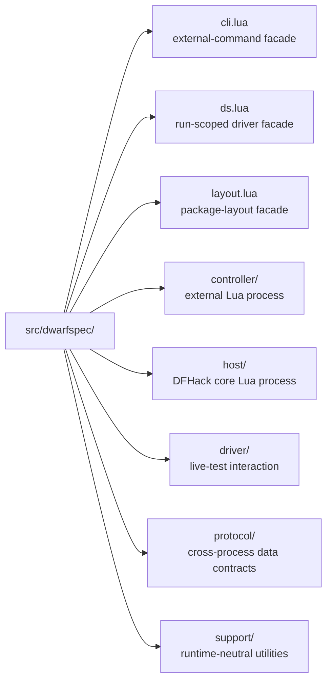
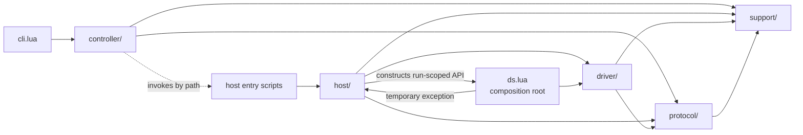
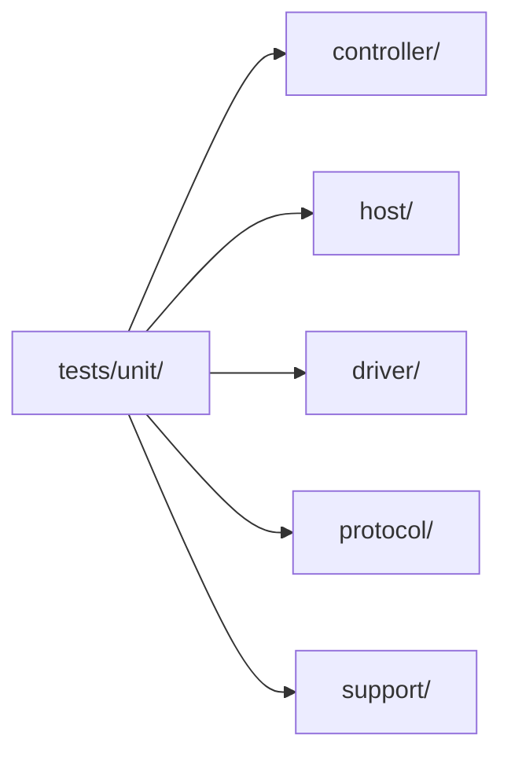

# Source Organization Proposal

## Status

Proposed. This document defines a source-tree cleanup; it does not authorize
implementation or change any public DwarfSpec behavior.

## Summary

Organize production modules by execution boundary and role: external
controller, in-process host, run-scoped driver, shared protocol, and shared
support. Keep a small set of stable top-level entry points, move shared wire
contracts into a runtime-neutral namespace, and make the unit-test tree mirror
the production tree.

The recommended top-level production layout is:

This layout reflects the four responsibilities already documented in
`docs/architecture.md`: the external command, the in-process host, the
run-scoped driver, and their shared deterministic reporting contracts.

## Why change the current layout

The current tree contains 92 production Lua modules and about 20,000 lines.
Forty-two modules are flat under `src/dwarfspec/`, while 46 more are grouped
under the broad `automation/` name. The result has several problems:

- a filename does not reveal whether it executes externally or inside DFHack;
- `automation/` combines entry scripts, scheduling, persistence, lifecycle,
  DFHack adapters, result contracts, and game operations;
- the flat root mixes CLI configuration, mounting, rendering, native widget
  traversal, public enums, reporting, and process execution;
- related modules are separated, such as `runner.lua` and the automation
  service modules it controls;
- generic names such as `project.lua` exist in both the root and
  `automation/`, with different responsibilities;
- source and installed paths are repeated as string literals in `ds.lua`,
  `layout.lua`, host entry scripts, tests, and integration helpers; and
- the largest files remain difficult to navigate even if their surrounding
  directory is renamed.

The cleanup should improve ownership and dependency direction, not merely
reduce the number of files visible in one directory.

## Design rules

### Execution boundary and role come first

A module that directly uses `df`, `dfhack`, or DFHack-provided modules belongs
under `host/` or `driver/`. A module that invokes `dfhack-run`, reads the local
project, or performs controller-specific terminal presentation belongs under
`controller/`. A module used on both sides must be pure Lua and belongs under
`protocol/` or `support/`. A canonical formatter required in both runtimes to
preserve one serialized diagnostic representation may remain beside that
protocol contract; broader terminal composition remains controller-owned.

### Dependencies point inward

The intended dependency direction is:

`controller/` must not require `host/` or `driver/`. The controller may select
and invoke host entry scripts by path, but it must not load their code into the
external interpreter. `protocol/` and `support/` must not depend on either
runtime. `driver/` may use DFHack but must not own run scheduling or service
persistence. As an explicit temporary exception, the root `ds.lua` facade is
the composition root that may load both host services and driver modules.
The host execution root may load `dwarfspec.ds` to construct the run-scoped
API; this is the other half of the documented composition exception. Modules
beneath `driver/` must not require modules beneath `host/` directly.

Files outside the organized namespaces have explicit dependency rules:

- `bin/dwarfspec` may load only the root `dwarfspec.cli` and
  `dwarfspec.layout` facades;
- during the initial directory migration, root `cli.lua` may load controller,
  protocol, and support modules directly; after its late decomposition, it may
  load only `controller.application`;
- root `layout.lua` remains standalone and does not import an organized
  runtime namespace; and
- root `ds.lua` follows only the temporary bidirectional composition exception
  documented above, plus ordinary protocol and support dependencies.

### Stable entry points stay shallow

Keep these existing module names during the cleanup:

- `dwarfspec.cli` as the executable's internal facade;
- `dwarfspec.layout` as the internal source-versus-installed path resolver;
  and
- `dwarfspec.ds` as the internal host factory for the run-scoped `ds` object.

They should become thin facades over the organized implementation. Retaining
them keeps the executable and host bootstrap decoupled from the internal
directory structure.

The public product surfaces are the `dwarfspec` executable and the run-scoped
`ds` API injected into live specifications. Source module paths, including
`dwarfspec.cli`, `dwarfspec.layout`, and `dwarfspec.ds`, are internal
implementation details and have no compatibility guarantee. Future modules
become public only through an explicit API decision; planned work such as
`dwarfspec.testbed` does not make a module public before it is implemented and
declared supported. Internal modules move atomically without forwarding
modules at their former paths.

### One concept, one name

Use names that distinguish the two current project concepts:

- `controller/discovery/project.lua` describes the project selected by the
  CLI; and
- `host/environment/project_environment.lua` loads project configuration and
  modules in the DFHack process.

Likewise, reserve `host/entrypoints/` for scripts invoked directly through
`dfhack-run`; reusable host modules must not be placed there.

## Initial directory-migration tree

```mermaid
flowchart TB
    root["src/dwarfspec/"]
    root --> cli["cli.lua"]
    root --> ds["ds.lua"]
    root --> layout["layout.lua"]

    root --> controller["controller/"]
    controller --> controller_configuration["configuration/<br/>config.lua<br/>dotenv.lua"]
    controller --> controller_discovery["discovery/<br/>project.lua"]
    controller --> controller_execution["execution/<br/>process.lua<br/>runner.lua"]
    controller --> controller_reporting["reporting/<br/>diagnostic_formatter.lua<br/>report.lua"]
    controller --> controller_result_store["result_store.lua"]

    root --> host["host/"]
    host --> host_entrypoints["entrypoints/<br/>abort.lua<br/>acknowledge.lua<br/>bootstrap.lua<br/>cancel.lua<br/>discard.lua<br/>event_read.lua<br/>probe.lua<br/>recover.lua<br/>recover_executor.lua<br/>run_query.lua<br/>scheduler_status.lua<br/>status.lua"]
    host --> host_execution["execution/<br/>busted_lifecycle_adapter.lua<br/>cleanup.lua<br/>coroutine_scheduler.lua<br/>file_suite_identity.lua<br/>host.lua<br/>output_handler.lua"]
    host --> host_service["service/<br/>projects.lua<br/>scheduler.lua<br/>service.lua<br/>snapshots.lua"]
    host --> host_environment["environment/<br/>extensions.lua<br/>lfs_adapter.lua<br/>project_environment.lua<br/>system_adapter.lua"]
    host --> host_diagnostics["diagnostics/<br/>base_screen_focus_guard.lua<br/>diagnostics.lua<br/>problem_source.lua"]
    host --> host_game["game/<br/>overlay_registration.lua<br/>save_game_load.lua<br/>save_game_mount.lua<br/>save_game_unload.lua"]

    root --> driver["driver/"]
    driver --> driver_commands["commands/<br/>await_event.lua<br/>save_game_load.lua<br/>save_game_unload.lua<br/>text_search.lua"]
    driver --> driver_input["input/<br/>input_states.lua<br/>mouse_buttons.lua<br/>pointer_anchors.lua<br/>pointer_adapter.lua<br/>pointer_spaces.lua"]
    driver --> driver_mount["mount/<br/>component.lua<br/>mount_adapters.lua<br/>mount_context.lua<br/>native_attachment.lua<br/>overlay_mount.lua"]
    driver --> driver_render["render/<br/>native_render_observer.lua<br/>render_instrumentation.lua<br/>render_tracker.lua"]
    driver --> driver_subjects["subjects/<br/>interaction_target.lua<br/>lua_view_adapter.lua<br/>native_game_ui_path.lua<br/>native_widget_adapter.lua<br/>overlay_registry_adapter.lua<br/>subject.lua<br/>subject_paths.lua<br/>subject_requests.lua<br/>subject_sources.lua<br/>native_resolution_failure_kinds.lua<br/>native_resolution_stages.lua"]
    driver --> driver_screen_origins["screen_origins.lua"]
    driver --> driver_state_change_events["state_change_events.lua"]

    root --> protocol["protocol/"]
    protocol --> protocol_events["events.lua"]
    protocol --> protocol_schemas["schemas.lua"]
    protocol --> protocol_configuration["configuration/<br/>error_formats.lua<br/>schema.lua<br/>settings.lua"]
    protocol --> protocol_diagnostics["diagnostics/<br/>base_screen_focus_comparisons.lua<br/>focus.lua<br/>focus_warning.lua"]
    protocol --> protocol_enums["enums/<br/>event_types.lua<br/>owner_kinds.lua<br/>result_policies.lua<br/>result_states.lua<br/>runner_failure_kinds.lua<br/>run_states.lua<br/>scheduler_failure_kinds.lua<br/>test_statuses.lua"]

    root --> support["support/"]
    support --> support_files["glob.lua<br/>identity_labels.lua<br/>immutable_enum.lua<br/>project_paths.lua"]
```

This graph is the required tree at the initial directory-migration milestone.
It intentionally retains the large implementation modules that are decomposed
later. The CLI split is already specified as `controller/application.lua` and
`controller/command_line.lua`. Before implementing each other late
decomposition, create and approve a focused proposal that names its extracted
modules, dependency changes, direct tests, and proposed Mermaid subtree. The
full source-organization tree is the initial graph plus the CLI modules and
those approved decomposition subtrees; it is not implied by unnamed helper
modules.

`ds.d.lua` remains at `src/ds.d.lua`. It is a declaration surface rather than
an installed implementation module and should not be mixed into the runtime
hierarchy.

## Current-to-target mapping

| Current area | Target area | Notes |
|---|---|---|
| root `cli.lua` | root facade plus `controller/application.lua` and `controller/command_line.lua` | Perform this decomposition near the end, after the namespace migrations and larger runtime splits are stable. |
| `config.lua`, `dotenv.lua` | `controller/configuration/` | These load external process configuration and environment values. |
| `config_schema.lua`, `settings.lua`, `error_formats.lua` | `protocol/configuration/` | Both the controller and host validate the same consumer configuration contract. |
| `glob.lua` | `support/` | Glob compilation is pure and is used by both controller and host project discovery. |
| root `project.lua` | `controller/discovery/` plus `support/project_paths.lua` | Keep controller project discovery external and extract only the pure path operations needed across runtimes. |
| `runner.lua`, `process.lua`, `runner_failure_kinds.lua` | `controller/execution/` and `protocol/enums/` | Runner failure data stays runtime-neutral because the host emits it. |
| `report.lua`, `diagnostic_formatter.lua` | `controller/reporting/` | Formatting belongs to the external presentation boundary. |
| automation entry scripts | `host/entrypoints/` | These remain standalone scripts callable by absolute path. |
| `automation/host.lua`, lifecycle and coroutine modules | `host/execution/` | This is embedded Busted execution, not the service model. |
| automation scheduler, service, projects, and snapshots | `host/service/` | Snapshots project mutable service registries and therefore remain host-owned. |
| automation project and extension loaders | `host/environment/` | Rename the host-side `project.lua` to remove ambiguity. |
| automation diagnostic, focus-observation, and problem-source modules | `host/diagnostics/` | Move `base_screen_focus_guard.lua` here as the host observer. Split the existing focus diagnostic module instead of treating it as capture code. |
| automation save-game and registration modules | `host/game/` | These perform DFHack state transitions. |
| `component.lua`, mount modules | `driver/mount/` | These own the mounted resource lifecycle. |
| subject, native lookup, and view adapter modules | `driver/subjects/` | These implement selection and retained identity. |
| render modules | `driver/render/` | These implement invalidation and completed-render observation. |
| `commands/` | `driver/commands/` | Built-in commands are part of the run-scoped driver. |
| `automation/pointer_adapter.lua` | `driver/input/` | Pointer movement is interaction behavior, not run orchestration. |
| event, schema, state, policy, and cross-runtime failure vocabulary | `protocol/` | These values cross the controller/host boundary. Move focus comparison values and validation here, and keep stable shared warning formatting in `protocol/diagnostics/focus_warning.lua`. Driver-only enums stay with the driver. |
| immutable enum and identity-label helpers | `support/` | Keep this directory small and dependency-free. |

`result_store.lua` remains in `controller/`, but its current dependency on
host-owned project state must be removed first. Extract the pure path
normalization it needs into `support/project_paths.lua`; do not move the host
project registry into the controller. Move the current pure event contract,
validation, and journal operations together into `protocol/events.lua`; do not
invent a host-side event-validation module. Move the focus comparison enum and
payload validator into `protocol/diagnostics/`, move the shared stable warning
formatter into `protocol/diagnostics/focus_warning.lua`, and keep native focus
observation in `host/diagnostics/base_screen_focus_guard.lua`. `schemas.lua`
then remains protocol code, and
`snapshots.lua` remains under `host/service/` because it projects mutable host
registries.

## Path and loading strategy

Physical moves currently affect more than `require()` calls. Several modules
are deliberately loaded with `loadfile()` so the host receives fresh code and
so source checkouts and installed LuaRocks trees behave the same. Preserve
that behavior.

Before moving modules:

1. Extend `dwarfspec.layout` into the single authority for source and installed
   paths to host entry scripts.
2. Keep small local loading functions in the `ds.lua` and host composition
   roots. Where appropriate, derive a source path mechanically from the
   canonical module name instead of repeating paired arguments such as
   `('dwarfspec.component', '/src/dwarfspec/component.lua')`.
3. Preserve each composition root's explicit cache and freshness behavior.
   Do not replace deliberate `loadfile()` calls with ordinary `require()` calls
   as part of the directory cleanup.
4. Update source-identity classification in `host/diagnostics/problem_source`
   to recognize the organized tree without exposing absolute local paths.

The entrypoint scripts need a tiny duplicated bootstrap that derives the Lua
module root before normal module loading is available. That exception is
intentional; the list of downstream host paths should not be duplicated.

## Large-module decomposition

Directory moves and file decomposition should be separate commits. First move
cohesive modules without changing their behavior. Once the new dependency
boundaries are enforced, split the six current hotspots:

- `ds.lua` (about 2,000 lines): retain construction and public command binding
  in the facade; move command argument validation, normalization, and
  driver-side adapters for mount, pointer, event, game-state, and wait behavior
  into driver command modules. This extraction does not move or redesign the
  underlying save-game, overlay-registration, or diagnostic workflows assigned
  to `host/`; those ownership changes remain follow-up work.
- `automation/host.lua` (about 1,400 lines): separate run assembly, Busted
  execution, example lifecycle, module-environment audit, and transport
  publication.
- `automation/scheduler.lua` (about 1,100 lines): separate queue selection,
  lease/quarantine policy, and transition recording while keeping one service
  state owner.
- `mount_context.lua` (about 1,100 lines): separate resource ownership,
  subject resolution, command execution diagnostics, and cleanup verification.
- `runner.lua` (about 1,000 lines): separate command construction, process
  transport, polling, timeout/abort handling, and result interpretation.
- `cli.lua` (about 700 lines): near the end of the work, move argument parsing,
  option validation, and help construction into `controller/command_line.lua`;
  move command selection and orchestration into `controller/application.lua`;
  retain only delegation from the stable root facade.

Each extraction must introduce a named responsibility with its own direct
tests. Avoid generic dumping grounds such as `utils.lua`, `helpers.lua`, or
`common.lua`.

## Test organization

As each production dependency cluster moves, mirror its tests beneath
`tests/unit/`:

Update `tools/Run-UnitTests.ps1` before moving any unit specs. Remove Busted's
`--no-recursive` option so its normal recursive discovery includes every
nested spec beneath `tests/unit/`. Add an inventory assertion or a nested
sentinel spec so the repository gate fails if recursive discovery is disabled
again or silently executes only the top-level files.

Keep live suites under `tests/automation/`, destructive live suites under
`tests/destructive/`, and multi-process scenarios under `tests/integration/`.
Those directories describe execution cost and environment, which is useful to
operators and test scripts.

Rename unit specs to match the target module path, for example:

- `tests/unit/mount_context_spec.lua` becomes
  `tests/unit/driver/mount/mount_context_spec.lua`;
- `tests/unit/automation_service_spec.lua` becomes
  `tests/unit/host/service/service_spec.lua`; and
- `tests/unit/config_spec.lua` is split by ownership: configuration-file
  loading remains in `tests/unit/controller/configuration/config_spec.lua`,
  while schema, settings, and error-format cases move to focused specs under
  `tests/unit/protocol/configuration/`.

Move each production dependency cluster atomically with all corresponding
`require()` paths, `loadfile()` paths, and unit-test paths. Every migration
commit must remain testable. Do not move checked-in protocol fixtures or
generated `.test-results` merely to make the tree look symmetric.

## Implementation sequence

0. **Phase 0 -- initial test baseline:** Record the current unit, syntax,
   source-declaration, focused live, and full non-destructive live-suite
   results. Record cleanup confirmation separately from test success.
1. Enable recursive Busted discovery and add the nested-test inventory guard
   before moving any unit spec.
2. Add dependency-boundary tests and centralize source/installed path
   resolution in the existing composition roots without moving modules.
3. Move the pure event and configuration contracts, then move the remaining
   protocol and support modules with their callers and tests.
4. Create `controller/`, retaining the three stable root facades.
5. Move the run-scoped implementation into `driver/`.
6. Replace `automation/` with `host/`, moving entry scripts last so external
   invocation remains continuously testable.
7. Update architecture and contributor documentation, including the explicit
   public-versus-internal source contract.
8. Declare the initial directory migration complete.
9. Create and approve focused decomposition proposals for `ds.lua`, host
    execution, the scheduler, mount context, and the runner, then implement them
    in small, separately verified changes. Each proposal contains its proposed
    Mermaid subtree before implementation.
10. As one of the final implementation steps, decompose `cli.lua` into
    `controller/command_line.lua` and `controller/application.lua`, leaving the
    stable root module as a thin facade.

The completion milestones are:

- **Initial directory migration:** the namespace moves, recursive test-tree
  migration, documentation updates, and source gates are complete.
- **Full source organization:** the late large-module decompositions,
  including the final CLI split, are complete and the full source gates pass.

Every move should use `git mv` and update one cohesive dependency cluster in
the same commit, including callers and tests. Keep behavior changes and
large-module decomposition separate from these atomic migration commits. Do
not combine this work with public API changes, new test-runner UI behavior,
TestBed implementation, or selector redesign.

## Verification gates

Each migration milestone is complete only when all applicable checks below are
independently demonstrated. Full source organization additionally requires all
decompositions listed in the implementation sequence:

- all unit tests pass from the source checkout;
- Lua syntax and repository formatting checks pass;
- dependency-boundary tests enforce the complete allowed-import matrix:
  `controller/` imports only controller, protocol, and support modules;
  `host/` imports host, driver, protocol, and support modules; `driver/`
  imports only driver, protocol, and support modules; `protocol/` imports only
  protocol and support modules; and `support/` imports only support modules;
- the boundary audit enforces the launcher and root-facade rules:
  `bin/dwarfspec` loads only `dwarfspec.cli` and `dwarfspec.layout`;
  `layout.lua` imports no runtime namespace; initial-migration `cli.lua`
  imports only controller, protocol, and support modules; and fully decomposed
  `cli.lua` imports only `controller.application`;
- the boundary audit covers static `require()` calls, literal and constructed
  `loadfile()` targets, and host entrypoint paths returned by `layout.lua`;
- the dependency audit recognizes both directions of the sole composition
  exception: `host/execution/host.lua` may load the root `dwarfspec.ds`
  facade, and that facade may load host and driver modules while otherwise
  depending only on protocol and support;
- the unit runner recursively discovers nested specs and verifies its expected
  test inventory;
- the CLI `help`, `list`, `run`, status, abort, recovery, and inspection paths
  resolve the new host entrypoint locations;
- focused live tests pass for component mounting, native-screen mounting,
  pointer input, events, save-game commands, cleanup, and scheduler recovery;
- the full non-destructive live suite is rerun with no new failures relative
  to the Phase 0 baseline; any pre-existing failures remain documented, and
  cleanup confirmation remains distinct from test success;
- source declarations still validate against the organized source tree using
  the source LuaLS configuration and its valid and invalid fixtures, without
  installed-rock or packaged-source verification;
- documentation contains no stale internal paths; and
- `git diff --check` passes with unrelated worktree state preserved.

## Risks and mitigations

### Hidden path coupling

Tests and host adapters use direct `loadfile()` paths. Centralize those paths
first, and update the existing composition-root and entrypoint tests alongside
each move.

### Runtime boundary violations

Pure-Lua unit tests can accidentally load a DFHack-only module through a new
dependency. Add a static import audit and isolated-load tests for `protocol/`
and `controller/`. Include literal and mechanically constructed `loadfile()`
targets in the audit so dynamic loading cannot bypass the allowed dependency
matrix.

### Accidental internal API expansion

Installing a Lua module does not by itself make its source path public.
Document the executable and injected run-scoped `ds` surface as public and the
source module tree as internal. Require an explicit API decision before future
work exposes a new require-able module to consumers.

### Review noise

Moves plus behavior edits obscure history. Keep each move, its require/load
path changes, and corresponding test moves together so the commit remains
green. Keep behavioral changes and later decompositions in distinct commits.

## Follow-up work

Create a separate implementation plan to remove the temporary `ds.lua`
composition exception. That plan should evaluate moving driver-facing
save-game workflows, overlay registration, and interaction diagnostics under
`driver/`, with host scheduling, cleanup, project-environment, and service
capabilities supplied through explicit injected interfaces.

The follow-up plan must:

- inventory every host module currently loaded by `ds.lua`;
- define the narrow capabilities the driver actually needs from each module;
- place run-scoped game operations according to ownership rather than their
  historical `automation/` location;
- preserve fresh `loadfile()` behavior and source-versus-installed loading;
- add boundary tests proving modules beneath `driver/` do not import
  `host/`; and
- provide incremental migration gates without changing the public `ds` API.

Until that plan is approved and implemented, `ds.lua` remains the sole
documented composition root allowed to load both namespaces.

## Decision

Adopt the execution-boundary-and-role organization above. Do not retain
`automation/` as the general home for all live-test code: it hides the
important distinction between host orchestration and the driver that a test
uses. Preserve shallow facades and source/installed loading semantics, then
enforce the new boundaries with tests before decomposing large files.
