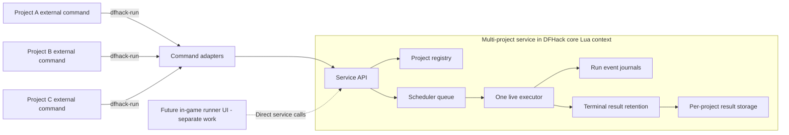
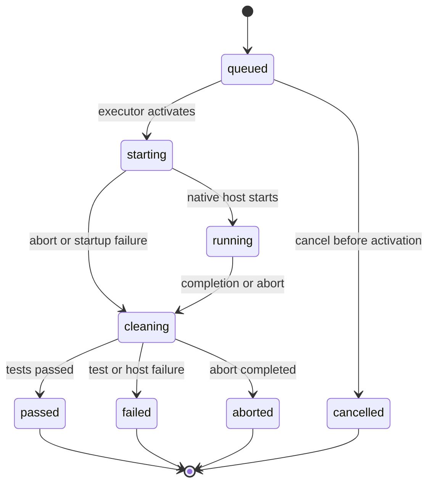

# Test runner service and structured event design

Status: proposed

## Summary

DwarfSpec will expose its live test runner through one multi-project automation
service hosted in DFHack's core Lua context. Any number of registered projects
may concurrently submit, observe, and cancel runs against the same Dwarf
Fortress game instance. The service queues those runs and executes one live
Busted suite at a time.

The external command will continue to communicate with DFHack through
`dfhack-run`. A future in-game test runner can call the same service directly
without requiring a browser, a localhost listener, or a second transport
protocol. Designing and implementing that UI is separate work and is not part
of this service implementation.

The service will replace line-oriented runner feedback with ordered structured
events and cursor-based reads over each run's event journal. The external
command will format events for a terminal. Future consumers, including the
separately designed in-game UI, can build their own presentation from the same
service data.

Each project will store its latest invocation result at the stable default
path:

```text
<project-root>/tests/.test-results/dwarfspec/results.json
```

The file will describe the latest invocation for that project only. A normal
run will never create a run-id-named result file unless the caller explicitly
selects a different output path.

## Goals

- Support concurrent run submissions from multiple projects against one
  running DFHack instance.
- Serialize live execution so shared game, screen, scheduler, and Lua state
  remain deterministic.
- Give the external command and future in-process clients one authoritative
  service API.
- Continue using `dfhack-run` for all external-to-DFHack communication.
- Represent runner and scheduler feedback as versioned, ordered, JSON-safe
  events.
- Isolate project configuration, selection, module loading, results, events,
  leases, and terminal acknowledgement.
- Preserve generation ownership, lease expiry, explicit cancellation or
  abort, and confirmed LIFO cleanup.
- Provide a presentation-neutral API suitable for a separately implemented
  in-game test runner.
- Store only the latest result per project by default in an ignored directory
  under that project's test tree.
- Represent every invocation outcome for which a project result path can be
  resolved, including queue cancellation and failures before native execution.
- Keep service requests and responses data-oriented so another transport can
  be added later without redesigning the runner.

## Non-goals

- DwarfSpec will not execute overlapping live Busted suites in one DFHack
  process.
- DwarfSpec will not add a localhost server or another socket implementation.
- DwarfSpec will not replace `dfhack-run` with a direct DFHack RPC client.
- DwarfSpec will not support execution on remote machines in this design.
- DwarfSpec will not persist default per-run history.
- DwarfSpec will not accept more than one outstanding run from the same
  project.
- DwarfSpec will not design or implement the in-game test runner UI as part of
  this work.
- DwarfSpec will not replace Busted's discovery, hooks, assertions, or result
  classification.

## Locked decisions

1. One DwarfSpec service runtime lives in each DFHack process.
2. The service owns one compatible DwarfSpec package version and package root.
3. Multiple project sessions may be registered concurrently.
4. Each registered project is identified independently of its display name.
5. Each project may own at most one queued, active, or unacknowledged terminal
   run.
6. Different projects may submit runs concurrently.
7. A deterministic global queue orders admitted runs by submission.
8. One DFHack process executes at most one live run at a time.
9. The next run starts only after the previous run confirms cleanup.
10. Unacknowledged terminal state blocks only its owning project.
11. Unconfirmed cleanup quarantines the entire service executor.
12. `dfhack-run` remains the only external transport.
13. A future in-game test runner will be a direct service client, but its
    design and implementation are separate from this service work.
14. Consumers never mutate `dfhack.dwarfspec`, project records, run records, or
    scheduler state directly.
15. Runner feedback is a structured event journal, not formatted output lines.
16. Every event has a service instance, project identity, run identity,
    generation, and monotonically increasing sequence number.
17. Queue ownership and active execution ownership use separate leases.
18. The default result file is
    `tests/.test-results/dwarfspec/results.json` beneath the owning project
    root.
19. The default result file is replaced for each invocation from that project.
20. Explicit alternate result paths name files, not directories.
21. The result document describes scheduler and runner failures as well as
    native test results.
22. Terminal results are acknowledged only after the configured persistence
    policy succeeds or an operator explicitly discards the retained result.
23. Canonically identical result paths cannot be owned by different
    outstanding runs at the same time.

## Rationale

`dfhack-run` already supplies DwarfSpec's supported external connection to a
running DFHack process. Replacing it would add protocol and compatibility work
without benefiting a future in-game screen, which will already share the host
Lua context with the test runner.

The missing abstraction is therefore not another server. It is a multi-project
service that separates registration, scheduling, run policy, and run state
from both transport formatting and screen presentation.

Live execution remains serialized because DwarfSpec tests share process-global
resources, including screens, pause state, virtual pointer state, frame
scheduling, `package.path`, `package.loaded`, and the DFHack Lua environment.
Queuing supports concurrent callers without pretending those resources can be
isolated inside one game process.

One outstanding run per project preserves the stable result-file contract. It
prevents an older completion from overwriting a newer queued invocation in the
same project's `results.json`. Multiple different projects remain independent
because their stable files live under different project roots.

## System context



The adapters translate process arguments and JSON output. They contain no
scheduler or run policy. The dashed UI edge documents only the future
integration boundary; no UI component is delivered by this design.

## Terminology

### Service instance

The process-wide DwarfSpec runtime that owns compatibility, projects, runs,
the queue, and the single executor. A service instance has an opaque identity
that changes when DFHack or the service is restarted.

### Project session

A registered consumer project with an explicit project root, normalized
configuration, result policy, and compatibility information. A project
session is configuration and identity; it does not keep consumer modules
loaded between runs.

### Project ID

An opaque service-assigned identifier for a registered normalized project
root. Registering the same normalized root again returns the existing
compatible project session. A caller-provided display name is never used as
identity.

### Run ID and generation

A service-assigned run ID identifies an admitted invocation. A monotonically
increasing generation protects callbacks, leases, cursors, and cancellation
from referring to a stale or replacement run.

### Run owner

The consumer that submits a run owns its queue and execution leases, result
persistence, normal cancellation or abort, and terminal acknowledgement. The
service returns an opaque owner capability to that consumer. Read-only
observation requires the run identity but not the capability; lease renewal and
normal mutations require both. An in-process client keeps its capability in
the service process. An external command keeps it only for the lifetime of that
command.

An authorized operator client may force abort or explicitly discard a retained
result for recovery. Operator recovery is recorded as an event and does not
silently impersonate the original persistence owner. How an in-game UI exposes
that authority belongs to its separate design.

### Outstanding run

A run that is queued, starting, running, cleaning, or terminal but not yet
acknowledged or explicitly discarded. A project owns at most one outstanding
run.

### Executor

The single service-owned capability that may enter the native Busted host and
mutate shared DFHack state. The scheduler grants it to one queued run at a
time.

## Runtime and compatibility boundary

The service owns one `package_root`. That root supplies DwarfSpec, Busted,
adapters, the scheduler, cleanup, reporting, and the component driver. The
runner UI is not an implementation component of this service design.

Each project session owns one `project_root`. That root supplies project
configuration, selected live specs, custom commands, support modules, and
generated results.

The first compatible service bootstrap establishes the service package root
and protocol version. Later project registrations provide their client
protocol and package version but do not clear or replace service modules.

A registration is accepted when its client protocol and required service
version are compatible with the running service. An incompatible registration
fails without modifying the existing service, projects, queue, or active run.
The service does not attempt to load two DwarfSpec or Busted versions into the
same DFHack Lua environment.

Consumer module paths remain run-scoped. The executor installs the selected
project's module paths only after that run is activated. Cleanup restores the
exact previous `package.path` and protected module cache before the executor
can activate another project.

## Project registry

The registry stores ordinary data for each project:

```text
projects[project_id] = {
    normalized_project_root,
    display_name,
    normalized_configuration,
    result_path,
    result_policy,
    client_compatibility,
    registered_at,
    outstanding_run_id,
}
```

Project roots are converted to absolute paths, separators are normalized, and
lexical `.` and `..` segments are removed before identity comparison. Identity
is case-folded on Windows. This normalization does not resolve filesystem
aliases such as symlinks, junctions, or Windows short names; roots expressed
through different aliases remain distinct project sessions. The service
rejects an attempt to reuse a project ID for a different normalized root.

Registration never loads test files or consumer modules. Catalog and run
operations use the registered project record and perform their work in a
bounded request or activated run scope.

A project may be unregistered only when it has no outstanding run.
Disconnecting or releasing one consumer does not unregister project sessions
belonging to other consumers.

## Automation service

The automation service is the only public boundary over project, scheduler,
and run state. Its operations are conceptually:

| Operation | Purpose |
|---|---|
| `register_project(request)` | Register or refresh one compatible project session. |
| `unregister_project(project_id)` | Remove one idle project session. |
| `projects()` | Return immutable summaries of registered projects. |
| `catalog(project_id, request)` | Return deterministic spec identities and supported filters. |
| `submit(project_id, request)` | Admit and queue one project run. |
| `snapshot(run_id)` | Return the current immutable run summary. |
| `events(run_id, after_sequence)` | Return ordered events after a consumer cursor. |
| `cancel(run_id, owner_capability, reason)` | Cancel an owned queued run without native cleanup. |
| `abort(run_id, owner_capability, reason)` | Abort an owned active run and perform emergency cleanup. |
| `acknowledge(run_id, generation, owner_capability)` | Confirm successful handling of an owned terminal result. |
| `discard(run_id, generation, authority, reason)` | Explicitly release a retained terminal result. |
| `latest_result(project_id)` | Return one project's most recent terminal result. |
| `scheduler_snapshot()` | Return queue, executor, and quarantine state. |
| `recover_executor(request)` | Clear quarantine only after an explicit clean-state proof. |

These operation names describe the contract, not the final Lua calling syntax.
All requests and responses must be ordinary JSON-safe tables. They must not
expose screens, widgets, coroutines, timeout handles, cleanup actions, or other
DFHack userdata.

### Service registry

The process-wide `dfhack.dwarfspec` entry retains only a small compatible
service registry. Mutable implementation details stay private to service
modules. The registry contains:

- service protocol version and instance identity;
- service package root and version;
- next generation counter;
- project records keyed by project ID;
- run records keyed by run ID;
- the ordered scheduler queue;
- active run ID, if present;
- scheduler quarantine state and reason;
- most recent terminal result keyed by project ID.

Reloading compatible adapters must preserve projects, queued runs, the active
run, terminal results, and scheduler state. Loading an incompatible service
while any project or run is registered must fail without changing that state.

## Admission and identity

`submit(project_id, request)` validates the complete request before modifying
the queue. Admission requires:

- a registered compatible project;
- no outstanding run for that project;
- a valid deterministic selection;
- a valid result policy and, when file-backed, result path;
- for a file-backed policy, no other outstanding run that owns the same
  canonical result path;
- a non-quarantined or queue-accepting scheduler, according to policy;
- a unique caller request key when retry idempotence is requested.

The service assigns the authoritative run ID, generation, and owner capability.
The capability is returned only to the submitter and is never included in
events, snapshots, terminal output, or result files. A caller may provide a
high-entropy `request_key`, which is unique within the project session.
Repeating the same accepted request returns the existing identity and owner
capability instead of enqueuing a duplicate.

Another project's active or queued run is not a busy error. A successfully
admitted request returns a queued snapshot, including its run ID, project ID,
generation, and derived queue position.

A second outstanding request from the same project returns `project_busy` and
the existing run identity. The caller can observe that run. Only its owner or
an authorized operator can mutate or release it before another run is
submitted.

If another project already owns the requested canonical result path, admission
returns `result_path_busy` and that run's identity. This normally affects only
explicit `--results` paths because project-local defaults do not collide.

## Scheduler

The scheduler owns one deterministic global FIFO queue. Because each project
can contribute at most one outstanding run, no project can flood the queue and
starve later projects with a backlog of its own work.

When the executor is idle, the scheduler examines the queue head:

1. Remove entries whose queue ownership expired or was cancelled.
2. Skip no entry silently; a blocked entry retains its place or becomes a
   classified terminal scheduler failure.
3. Revalidate project registration, compatibility, selection, and project
   paths.
4. Assign the executor to the run.
5. Install only that project's run-scoped module and configuration state.
6. Start native Busted execution on a later DFHack frame.

Queue position is derived snapshot data. It may change when earlier runs are
cancelled or become terminal. The service does not emit an event for every
position change.

### Quarantine

The scheduler starts another project only after the active run reaches a
terminal state with confirmed cleanup. A persistence or acknowledgement
failure does not hold the executor when cleanup was confirmed; it blocks only
the owning project from submitting another run.

If cleanup is not confirmed, the scheduler enters quarantine:

- no queued run may enter native execution;
- queued requests remain observable and cancellable;
- all projects receive the same bounded quarantine reason;
- recovery requires an explicit clean-state proof;
- acknowledging or discarding a result does not clear quarantine.

This prevents one project's leaked screen, pointer, timeout, or module state
from contaminating another project's tests.

## Run state model

An admitted run begins in `queued`:



`passed`, `failed`, `aborted`, and `cancelled` are terminal service states.
`cancelled` means native execution never began and requires no native cleanup.

Cleanup confirmation is a separate required property for any run that entered
`starting`. A nominally passing Busted run without confirmed cleanup becomes
failed and quarantines the executor.

The persisted invocation result also represents outcomes outside the native
state model, including:

- invalid project or selection;
- incompatible service registration;
- queue ownership expiry;
- missing dependency;
- DFHack connection failure;
- bootstrap or status transport failure;
- queue timeout;
- external execution timeout;
- interruption;
- result persistence failure.

Those outcomes do not create fake native Busted states. They are classified by
the outer result document.

## Structured event journal

Each admitted run owns an append-only event journal until it is acknowledged
or explicitly discarded. The service is the only event publisher. Event
payloads are copied into the journal so later mutation of a request, Busted
element, diagnostic table, or counter cannot rewrite previous observations.

### Event envelope

Every event uses this envelope:

```json
{
  "schema": "dwarfspec.event.v1",
  "service_instance_id": "service-4",
  "project_id": "project-2",
  "run_id": "run-19",
  "generation": 19,
  "sequence": 4,
  "type": "run.activated",
  "elapsed_ms": 438,
  "payload": {
    "queue_wait_ms": 312
  }
}
```

Required envelope fields are:

- `schema`: exactly `dwarfspec.event.v1`;
- `service_instance_id`: the service lifetime that published the event;
- `project_id`: the owning registered project;
- `run_id`: the owning service-assigned run;
- `generation`: the immutable run generation;
- `sequence`: a one-based integer that increases by one for every run event;
- `type`: a stable namespaced event type;
- `elapsed_ms`: milliseconds since the run was admitted;
- `payload`: a JSON object, which may be empty.

Wall-clock timestamps are optional presentation metadata and are not used for
ordering. Sequence numbers are authoritative within one run.

### Initial event types

| Event type | Required payload |
|---|---|
| `run.queued` | normalized selection and queue admission metadata |
| `run.activated` | queue wait duration |
| `run.cancelled` | cancellation reason and owner |
| `run.started` | repeat count and options safe for display |
| `repeat.started` | repeat index and repeat count |
| `repeat.finished` | repeat index and counts |
| `test.started` | stable full test name and source identity when available |
| `test.finished` | stable full name, status, and duration |
| `problem.recorded` | kind, name, message, and optional trace |
| `command.started` | command name, subject identity, and safe arguments |
| `command.finished` | command name, status, duration, and optional snapshot reference |
| `diagnostic.recorded` | diagnostic kind and bounded JSON-safe content |
| `cleanup.started` | cleanup reason and pending action count |
| `cleanup.failed` | action name, reason, message, and optional trace |
| `cleanup.finished` | confirmation and verified mount cleanup state |
| `run.aborted` | abort reason |
| `run.finished` | terminal state, totals, and cleanup confirmation |
| `scheduler.blocked` | quarantine reason when the run cannot activate |

Every terminal transition ends with `run.finished`. A queued cancellation emits
`run.cancelled` followed by `run.finished` with `cleanup_required` set to
`false` and cleanup confirmation set to `true`; it never invokes native
cleanup.

Human-readable terminal lines are derived from events outside the service.
They are not stored as the primary protocol. An optional `display` field may
be added to individual payloads only when the text itself is meaningful test
data rather than protocol framing.

### Cursor reads

`events(run_id, after_sequence)` returns events whose sequence is greater than
the supplied cursor. It also returns `last_sequence`, allowing consumers to
advance even when no events are present.

Repeated reads with the same cursor return the same event values and ordering.
Reading events does not acknowledge a terminal result, mutate queue position,
renew a lease belonging to another owner, or discard journal entries.

### Retention

The service retains the complete journal for every queued or active run. It
also retains the most recent unacknowledged terminal run for each project.

Once a project's terminal result has been persisted and acknowledged, the
service may discard that journal and admit a replacement project run. Other
projects do not wait for that acknowledgement when the executor is clean.

This design intentionally provides one latest retained run per project, not
history. A future history feature requires an explicit storage policy and is
not inferred from the in-memory journals.

## Snapshots

A run snapshot represents current state, while events represent changes. A
status response includes both so a consumer can recover after missing any
number of polls.

The run snapshot contains at least:

- schema and protocol versions;
- service instance ID;
- project ID, run ID, and generation;
- service state and terminal flag;
- queue position and queue admission time while queued;
- activation time and queue wait duration after activation;
- current repeat and current test;
- current and cumulative Busted counts;
- last event sequence;
- queue and execution lease summaries;
- owner kind, without the owner capability;
- cleanup confirmation and cleanup reason;
- verified mount cleanup state;
- host error and trace, when present;
- failure summaries.

The scheduler snapshot contains:

- service instance identity and compatibility;
- active run and project IDs, if present;
- ordered queued run and project IDs;
- registered project summaries;
- quarantine state and reason.

Snapshots never contain live DFHack objects. Diagnostic component trees and
screen state are emitted as bounded JSON-safe values or referenced by an event
sequence.

## Queue and execution leases

Queued and active runs have different abandonment behavior.

### Queue lease

An externally owned queued run has a queue lease renewed by successful status
requests carrying its owner capability. If that lease expires, the service
cancels the queued run without invoking native cleanup and retains its terminal
snapshot and journal. It does not acknowledge the result automatically. The
still-running owner can recover from a transient transport failure, persist,
and acknowledge the cancellation; otherwise an operator can explicitly
discard it. Until then, only that project remains blocked; other projects
continue normally.

An in-process-owned queued run is attached to its project session rather than
the lifetime of a presentation object. Releasing a view does not cancel the
run. An explicit cancel action or project unregistration request owns
cancellation.

### Execution lease

The execution lease begins when the scheduler activates the run. An external
status request carrying the owner capability renews it. If the external owner
disappears, lease expiry aborts the active run and performs cleanup.

An in-process-owned active run uses a service-owned execution heartbeat that is
independent of any presentation object's lifetime.

### Timeouts

The external command distinguishes:

- queue timeout: maximum time waiting for activation;
- execution timeout: maximum time after activation.

The established `--timeout` option applies to execution. A separate
`--queue-timeout` option controls queue waiting and may support an explicit
unlimited value. Queue time never consumes the execution timeout budget.

Interrupting an external command cancels its queued run or aborts its active
run according to current state.

## `dfhack-run` transport adapters

Project registration, bootstrap, status, cancel, abort, and acknowledgement use
thin `dfhack-run` adapters over the service. UI loading is outside this
transport and outside this implementation scope.

The bootstrap adapter registers or refreshes its project, then submits a run.
It does not fail merely because another project is active. The status adapter
can retrieve any retained run by service-assigned run ID. The cancellation
adapter distinguishes queued cancellation from active abort through the
service state.

The external transport continues to emit one canonical prefixed JSON line so
unrelated DFHack console output cannot be mistaken for protocol data:

```text
DWARFSPEC_JSON { ... }
```

The JSON payload uses `dwarfspec.transport.v2` and contains:

```json
{
  "schema": "dwarfspec.transport.v2",
  "protocol": 2,
  "service_instance_id": "service-4",
  "project_id": "project-2",
  "run_id": "run-19",
  "generation": 19,
  "snapshot": {},
  "events": [],
  "last_sequence": 4
}
```

`OUTPUT`, `DETAIL`, `HOST_ERROR`, and similar formatted protocol lines become
diagnostic compatibility output only and can be removed after the version 2
consumer is authoritative. The canonical JSON line remains sufficient to
reconstruct all command feedback.

The transport parser validates schema, protocol, service instance, project ID,
run ID, generation, event sequence continuity, and required fields before
exposing data to the runner. A malformed active-run response retains the
current recovery behavior: attempt an explicit native abort without hiding the
original transport failure. A malformed queued-run response attempts a cancel
instead.

## External command behavior

An external `dwarfspec run` invocation performs this sequence:

1. Resolve the project, configuration, selection, result path, and
   `dfhack-run` executable.
2. Probe DFHack's core Lua context.
3. Register or refresh the project session and validate compatibility.
4. Submit one idempotent run request.
5. Write a new `queued` invocation result to the project's stable result path.
6. Format structured queue and run events for the terminal.
7. Poll status using the last consumed event sequence and renew the applicable
   lease.
8. Start the execution timeout only after `run.activated`.
9. On interruption, queue timeout, execution timeout, or malformed transport
   output, cancel or abort according to current state.
10. Persist the terminal invocation result.
11. Acknowledge the terminal generation only after the configured persistence
    policy succeeds.
12. Return the established classified process exit code.

If persistence fails, the command reports a host failure and does not
acknowledge the terminal generation. The failed project cannot submit another
run until persistence is retried or the result is explicitly discarded. Other
projects continue to queue and execute when cleanup was confirmed.

## UI integration boundary

The runner UI will be designed and implemented independently from this service.
This document commits only to the boundary it can consume:

- the UI will run in-game and call the automation service directly;
- it will not parse `dfhack-run` transport lines or require a browser;
- service requests, snapshots, events, catalogs, and results remain
  presentation-neutral;
- the service contains no widgets, navigation, layout, or other UI state;
- UI lifecycle events do not implicitly cancel or abort service-owned work.

The UI's features, interaction model, project navigation, command entry point,
rendering, and UI-specific verification will be defined by a separate design.

## Result storage

### Default path

Each project has an independent default result file:

```text
<project-root>/tests/.test-results/dwarfspec/results.json
```

The path is beneath the consumer project, never the service package root. The
`.test-results` directory is expected to be ignored; DwarfSpec's own
`.gitignore` already ignores that directory recursively.

`--results PATH` names an exact file. A relative path is resolved beneath the
owning project root. This intentionally replaces the earlier directory-valued
option semantics. `--no-results` selects a no-persistence policy for callers
that do not need the latest-result contract.

### Replacement and admission policy

Default persistence never incorporates a run ID into the filename. Each
project invocation replaces that project's `results.json`. DwarfSpec may use a
temporary sibling file during a safe replacement, but it must clean that file
and must not retain it as history.

The one-outstanding-run-per-project admission rule makes replacement
unambiguous. A project cannot queue a newer run while an older queued, active,
or unacknowledged result still owns its stable file.

At admission, the result is replaced by a `queued` document. It becomes
`starting` when the executor activates the run and is replaced again when the
invocation reaches a terminal outcome.

If the persistence owner terminates without a final write, the remaining
nonterminal record correctly communicates that the project's latest invocation
did not complete from that owner's perspective.

Different projects write different files under their own roots and never
serialize on a shared result artifact.

For file-backed policies, the service reserves each canonical result path for
its outstanding run. Admission rejects an explicit path already reserved by
another project, which prevents independently owned persistence writers from
racing on one file.

### Result schema

The persisted document uses `dwarfspec.result.v2`:

```json
{
  "schema": "dwarfspec.result.v2",
  "service_instance_id": "service-4",
  "project_id": "project-2",
  "run_id": "run-19",
  "generation": 19,
  "state": "failed",
  "terminal": true,
  "exit_code": 6,
  "project_root": "D:/project",
  "selection": {
    "identities": ["tests/settings.ds.lua"]
  },
  "submitted_at": "2026-07-22T12:00:00Z",
  "activated_at": "2026-07-22T12:00:01Z",
  "finished_at": "2026-07-22T12:00:03Z",
  "queue_wait_ms": 1000,
  "error": null,
  "host_report": {},
  "events": []
}
```

The outer `state` describes the whole invocation. It may contain the stable
service states or a runner classification such as `dependency_error`,
`connection_error`, `registration_error`, `queue_timeout`, `host_error`,
`timeout`, or `interrupted`.

`host_report` contains the final native snapshot when the run entered the
executor. It is `null` for cancellation or failure before native execution.
`events` contains the complete retained event journal available to the
persistence owner.

Sensitive environment values, arbitrary process environment contents, and
raw DFHack objects are never persisted. Project and spec paths are normalized
for stable display but are not treated as portable remote identities.

## Persistence ownership and terminal retention

Exactly one component owns result writes for an invocation:

- for `dwarfspec run`, its external command owns queued, activation, and
  terminal writes;
- for a direct in-process client, the service-side client integration owns
  those writes;
- transport adapters never write results independently.

The run request records its persistence owner and exact result path. Queue
cancellation and recovery abort do not transfer ownership. The owner writes
the terminal result before acknowledging it to the service.

When `--no-results` is selected, the persistence policy succeeds without a
file write after the owner has received the complete terminal snapshot and
event journal. The owner can then acknowledge the terminal generation. A
write failure under a file-backed policy is not equivalent to `--no-results`.

An unacknowledged terminal run remains addressable by run ID and blocks only
its project from submitting a replacement. It does not occupy the executor and
does not prevent other project runs from activating when cleanup was
confirmed.

An explicit discard records a bounded reason, releases the exact retained
project/run/generation tuple, and is never performed as automatic recovery
from a write failure.

## Cleanup and executor release

Structured events and project queuing do not weaken existing cleanup behavior.
Example completion, assertion failure, command timeout, execution timeout,
lease expiry, explicit abort, and early unmount continue to drain owned
resources in strict LIFO order.

Cleanup completion emits `cleanup.finished` only after the lifecycle probe
confirms that no active mount, screen, subject, scheduler, wait, pointer,
timeout, project module path, or evictable consumer module remains.
`run.finished` follows cleanup and reports the same confirmation.

The executor is released only after the active generation becomes terminal.
If cleanup was confirmed, the scheduler may activate another project even
while the previous project's terminal result awaits persistence or
acknowledgement. If cleanup was not confirmed, the executor enters quarantine
and no project may activate.

## Concurrency contract

DwarfSpec supports concurrent projects, not overlapping live executions.

The supported contract is:

> Multiple registered projects may concurrently submit and manage live test
> runs against one DFHack instance. DwarfSpec queues admitted runs in
> deterministic submission order and executes one at a time, activating the
> next only after cleanup of the previous execution is confirmed.

Concurrent `dfhack-run` status requests may observe different queued, active,
or terminal runs. Service operations must remain atomic within DFHack's core
Lua context and must validate project ID, run ID, generation, and owner before
mutation.

A project-specific persistence failure isolates that project. A cleanup
failure isolates the executor and therefore all projects. These conditions are
reported separately and are never collapsed into a generic busy result.

## Future transport compatibility

Remote execution is intentionally deferred. The design leaves a narrow door
open by requiring:

- JSON-safe service requests and responses;
- service, project, run, and generation identities instead of userdata;
- versioned scheduler snapshots, run snapshots, events, and results;
- cursor-based event retrieval;
- explicit registration, submission, cancellation, abort, persistence,
  acknowledgement, and discard operations;
- no UI logic inside service or scheduler methods.

A future agent can translate a secure transport into these service operations.
It must also solve authentication, encryption, project synchronization,
package deployment, and remote path identity. Enabling DFHack's unrestricted
remote command listener is not considered a DwarfSpec remote execution design.

## Compatibility

The existing CLI command names and exit-code meanings remain stable. Terminal
text may become clearer, but the same test, dependency, connection, host,
timeout, and abort classifications remain available. Queue cancellation and
queue timeout receive distinct classifications without changing existing code
meanings.

The `dwarfspec.run.v1` native report can be accepted during transition, but
new adapters and persistence use the version 2 transport, snapshot, event, and
result schemas. Schema changes require an explicit version increment; readers
must reject unknown major versions instead of guessing.

The service-assigned run ID correlates external commands, project state,
events, results, and diagnostics. Generation remains required to prevent a
stale callback, lease, cancellation, or cursor from referring to a replacement
run.

Existing single-project callers remain valid. When no other project is queued,
their admitted run activates as soon as the executor becomes available.

## Proposed module boundaries

The implementation is expected to converge on boundaries similar to:

| Module | Responsibility |
|---|---|
| `dwarfspec.automation.service` | Public multi-project service operations and registry compatibility. |
| `dwarfspec.automation.projects` | Project identity, registration, compatibility, and configuration. |
| `dwarfspec.automation.scheduler` | Admission queue, leases, activation, executor release, and quarantine. |
| `dwarfspec.automation.events` | Event construction, validation, copying, sequencing, and cursor reads. |
| `dwarfspec.automation.host` | Busted execution, native state transitions, and cleanup. |
| `dwarfspec.automation.output_handler` | Translation from Busted callbacks into service events. |
| `dwarfspec.automation.result_store` | Per-project result schema and safe replacement writes. |
| command adapters | `dfhack-run` argument and JSON transport translation. |
| `dwarfspec.runner` | External registration, submission, polling, formatting, recovery, and exit classification. |
| `dwarfspec.report` | Transport/result schema validation and external persistence support. |

Exact filenames may change, but projects, scheduling, events, host execution,
transport, and persistence must remain separate responsibilities. UI modules
belong to the separate runner UI implementation and consume only the public
service boundary.

## Verification requirements

### Offline contracts

- Registering distinct normalized project roots produces distinct project IDs.
- Registering the same normalized root returns the same compatible project.
- An incompatible client cannot replace the running service or its projects.
- Different projects can submit while another project is active.
- A second outstanding submission from the same project returns
  `project_busy` and the existing run identity.
- Explicit result paths cannot collide across outstanding project runs.
- Accepted runs enter one deterministic global FIFO queue.
- Repeated request keys do not enqueue duplicate runs.
- Read-only consumers cannot renew leases, cancel, abort, acknowledge, or
  discard another owner's run.
- Owner capabilities never appear in events, snapshots, terminal output, or
  persisted results.
- Only one run owns the executor at a time.
- Queue cancellation never invokes native cleanup.
- Queue lease expiry retains a terminal cancellation until its owner
  acknowledges it or an operator explicitly discards it.
- The next run activates only after confirmed cleanup.
- Unacknowledged terminal state blocks only its project.
- Unconfirmed cleanup quarantines all activation until explicit recovery.
- Project module paths and newly loaded consumer modules are restored before
  another project activates.
- Queue and execution leases expire through their distinct cancellation and
  abort paths.
- Queue time does not consume the execution timeout budget.
- Event sequences start at one, are contiguous, and are immutable after
  publication.
- Every event contains matching service, project, run, and generation identity.
- Cursor reads are deterministic, resumable, and do not duplicate events.
- Every Busted outcome produces the expected structured events and counts.
- Cleanup errors produce events without hiding the original failure.
- Snapshot and event values contain no userdata or cyclic tables.
- Transport version 2 rejects mismatched service, project, run, generation, or
  event sequence data.
- Each project's default path resolves to
  `tests/.test-results/dwarfspec/results.json` beneath its own root.
- Two different projects write independent stable result files.
- A queued result becomes starting only when its run activates.
- Two sequential runs from one project leave one result file and the second
  result replaces the first.
- A pre-execution failure replaces that project's earlier successful result.
- Explicit result paths name files, and `--no-results` performs no write.
- Persistence failure prevents acknowledgement only for the owning project.
- Explicit discard releases only the exact project, run, and generation and
  records its reason.

### Live DFHack contracts

- Two consumer projects can submit concurrent external commands to one DFHack
  instance; one runs while the other remains queued and observable.
- The queued project activates after the first project confirms cleanup.
- Terminal persistence or acknowledgement delay in one project does not stop a
  clean queued run from another project.
- A cleanup failure in one project quarantines the executor before another
  project starts.
- Consumer modules, paths, screens, pointer state, pause state, and timers from
  one project do not leak into the next project.
- Cancelling a queued external run does not disturb the active project.
- Losing a queued external command expires its queue lease without native
  cleanup.
- Losing the active external command expires its execution lease and confirms
  native cleanup.
- The external command streams formatted version 2 events through
  `dfhack-run` and returns the established exit codes.
- Timeout, interruption, explicit abort, assertion failure, host error, and
  cleanup failure retain their cleanup guarantees.

### Packaging and documentation contracts

- All new project, scheduler, service, event, result-store, and adapter modules
  are included in the rockspec.
- The source checkout and installed rock enforce the same single-runtime
  compatibility rules.
- CLI help documents queue waiting, execution timeout, and exact result-file
  semantics.
- User documentation describes concurrent project submission and serialized
  live execution explicitly.
- Service documentation identifies the future in-game runner as a separate
  in-process client, not part of the service implementation.
- The default result directory is documented as generated and ignored.

## Deferred decisions

The following details require separate focused designs:

- the component-tree snapshot schema and size limits;
- whether command snapshots are embedded or referenced within the latest
  result;
- event-journal size limits for unusually large suites;
- explicit executor recovery probes after unconfirmed cleanup;
- multi-instance target discovery and scheduling;
- secure remote agents and project synchronization.

None of these deferred decisions changes multi-project registration, FIFO
admission, serialized execution, event ordering, per-project result location,
stable filenames, or cleanup-gated executor ownership established here.
