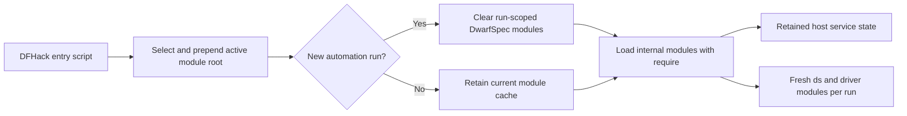

# Unified Internal Module Loading Proposal

## Summary

Use ordinary `require()` for all internal DwarfSpec modules in both source
checkouts and installed LuaRocks layouts. Before requiring DwarfSpec modules,
each host entrypoint will prepend the active module root to `package.path`.
Run-scoped cached modules will be cleared once at the start of a new automation
run, while retained host-service modules will remain loaded.

Direct DFHack entry scripts will continue to be invoked by file path. This
proposal changes internal module loading only.

## Motivation

The current composition roots accept both a canonical module name and a source
path. They use `loadfile()` when the source file exists and fall back to
`require()` for an installed package. This duplicates module identities and
paths, gives source and installed layouts different cache behavior, and makes
every internal move update two references.

Both layouts already configure `package.path`. A single cache boundary allows
ordinary `require()` to provide the required freshness without maintaining a
second path-based loading mechanism.

## Proposed behavior

The cache contract will be explicit:

- The host records the active DwarfSpec module root. If that root changes, it
  removes the complete `dwarfspec` namespace from `package.loaded` before
  loading from the new root; retained service data remains in the existing
  `dfhack.dwarfspec` registry rather than in module-local state.
- `dwarfspec.ds`, driver modules, and run-scoped host-execution modules are
  removed from `package.loaded` before a new suite is constructed.
- Host service modules remain cached across status, query, abort, recovery, and
  scheduler entrypoints.
- Protocol and support modules may remain cached because they contain no
  mutable run-owned state.
- Every internal module is then loaded by its canonical name with ordinary
  `require()`.
- The active source or installed root is prepended before cache invalidation
  and loading, ensuring a source run cannot reuse an installed module after a
  root change.

Cache invalidation will remain entrypoint bootstrap behavior. It will not
replace or wrap `require()`, modify package searchers, introduce a shared module
loader, or alter project-spec module isolation.

## Scope

The change will:

- remove the local dual-mode loaders from `ds.lua` and the host composition
  root;
- replace paired module-name/source-path arguments with canonical
  `require()` calls;
- define the run-scoped and retained module sets after the organized namespaces
  exist; and
- consolidate the existing entrypoint cache-clearing rules around that
  ownership model.

The change will not alter direct `dfhack-run` entry-script paths, the public
`ds` API, project test loading, package contents, scheduler persistence, or
service transport behavior.

## Verification

Unit coverage will prove that:

- the configured source root takes precedence over an installed module root;
- repeated imports within one run return the same module instance;
- starting a later run creates fresh `ds` and driver instances;
- status, query, abort, and recovery retain access to the same host service;
  and
- no composition root retains paired module-name/source-path literals.

Focused live coverage will run consecutive suites and exercise status, abort,
recovery, scheduler state, and cleanup. The change is acceptable only if these
results introduce no regression relative to the established baseline.

## Timing

Implement this only after the source-organization work establishes the final
controller, host, driver, protocol, and support namespaces. Those ownership
boundaries are required to define the cache sets accurately.
